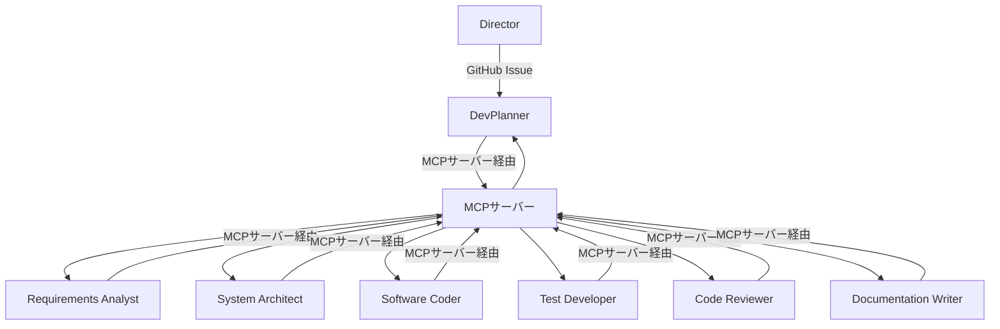

# はじめに<!-- omit in toc -->

## 目次<!-- omit in toc -->
- [はじめに](#はじめに-1)
- [1. 概要調査:DevPlannerによるタスク分割とAIエージェント起動](#1-概要調査devplannerによるタスク分割とaiエージェント起動)
  - [1.1. 目的](#11-目的)
  - [1.2. 概要](#12-概要)
  - [1.3. 特徴](#13-特徴)
  - [1.4. サポート機能一覧](#14-サポート機能一覧)
  - [1.5. イメージ図/構成図](#15-イメージ図構成図)
  - [1.6. API一覧](#16-api一覧)
    - [GitHub API（Issue取得、コメント投稿等）](#github-apiissue取得コメント投稿等)
    - [MCPサーバーAPI(タスク依頼、状態取得等)](#mcpサーバーapiタスク依頼状態取得等)
- [2. DevPlannerについて](#2-devplannerについて)
- [3. AIエージェントについて](#3-aiエージェントについて)

## はじめに

「戦闘力100倍プロジェクト」では、ソフトウェアの進化サイクルのコアとなる「DevOps」「MLOps」「不具合解析」にAIエージェントを活用し、従来の外注開発で数ヶ月かかる作業を大幅に短縮する技術の開発を目的とする。

本プロジェクト（AIエージェント活用自動ソフト開発プロジェクト）では、AIエージェントのフレームワークを試作し、生産性の大幅な向上を目標とする。

本資料は、DevPlannerエージェントによるタスク分割とAIエージェント起動の設計・実装に関する調査結果をまとめたものである。AIエージェント分割の目的、構成、特徴、サポート機能、インターフェース、運用イメージ等を整理し、ビジネス活用の観点から報告する。

### 注意点<!-- omit in toc -->
**AIエージェントは2025年12月初旬にAgentCoreを使用する方針に変更となった。現在はAIエージェントの実装方針は検討中であり、以下の内容や（TBD）箇所は今後変更となる可能性がある。**  
**ただし、今後の検討でAgentCoreが使用できないAIエージェント呼び出しが発生した場合は、既存案を採用する可能性がある。**  
AgentCoreについては以下のGitHubリポジトリを参照のこと:  
https://github.com/IoVPF-AgenticSoftwareEngineering/dora2

---

## 1. 概要調査:DevPlannerによるタスク分割とAIエージェント起動

### 1.1. 目的
- ソフトウェア開発におけるタスク分解の自動化と効率化
- 各工程ごとに最適なAIエージェントを割り当て、開発プロセス全体の品質・スピード向上を図る

### 1.2. 概要
DevPlannerは、GitHub Issueを起点に、ソフトウェア開発工程ごとにタスクを自動分解し、各タスクをAIエージェントに割り当てて実行するAIエージェントです。

### 1.3. 特徴
- GitHub ActionsワークフローでIssueを参照し、内容やラベルから分解対象・処理フローを自動判定
- 分解タスクごとにAIエージェントを起動し、AWS EC2インスタンス上でMCPサーバー経由で実行（TBD）
- 各AIエージェントはDevPlannerのみが呼び出し可能とし、エージェント同士の直接呼び出しは禁止（TBD）
  - マネージャーエージェント（Director/DevPlanner）間の呼び出し：OK
  - マネージャーエージェント（DevPlanner）からワーカーエージェント（各専門エージェント）への呼び出し：OK
  - ワーカーエージェント同士の呼び出し：NG
- セキュアなAWS OIDC認証・最小権限設計・疎結合な連携

### 1.4. サポート機能一覧
- GitHub Issueの自動取得・判定
- タスク分解・割当・進捗管理
- MCPサーバー経由のAIエージェント実行（TBD）
- コマンド実行例：`cd /home/ubuntu/work/agent/coding_agent && ./run_coding_agent_official.sh`（TBD）
- ログ・エラー管理、拡張性の高い設計（TBD）

### 1.5. イメージ図/構成図

### 1.6. API一覧

#### GitHub API（Issue取得、コメント投稿等）
DevPlannerはGitHub Actionsワークフローを通じて、GitHub APIを利用しIssueの取得・コメント投稿・ラベル判定などを行います。
- 主な利用API: Issues, Comments, Labels, Workflow Dispatch

#### MCPサーバーAPI(タスク依頼、状態取得等)
DevPlannerとAIエージェント間の通信は、必ずMCPサーバーAPIを経由します。
また、各種AIエージェントがGitHubを操作する場合も同様にMCPサーバーAPIを経由します。

## 2. DevPlannerについて

DevPlannerについての詳細は、[02_DevPlannerについて.md](./02_DevPlannerについて.md)を参照。

## 3. AIエージェントについて

AIエージェントについての詳細は、[03_AIエージェントについて.md](./03_AIエージェントについて.md)を参照。

***

[目次](#目次)
