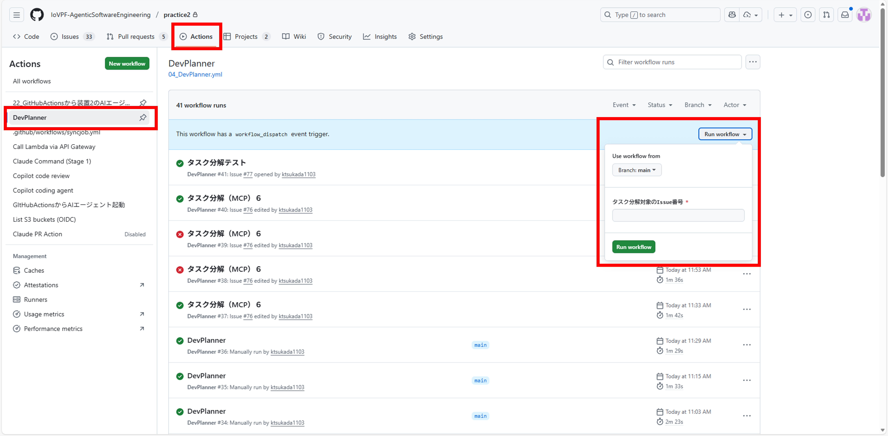
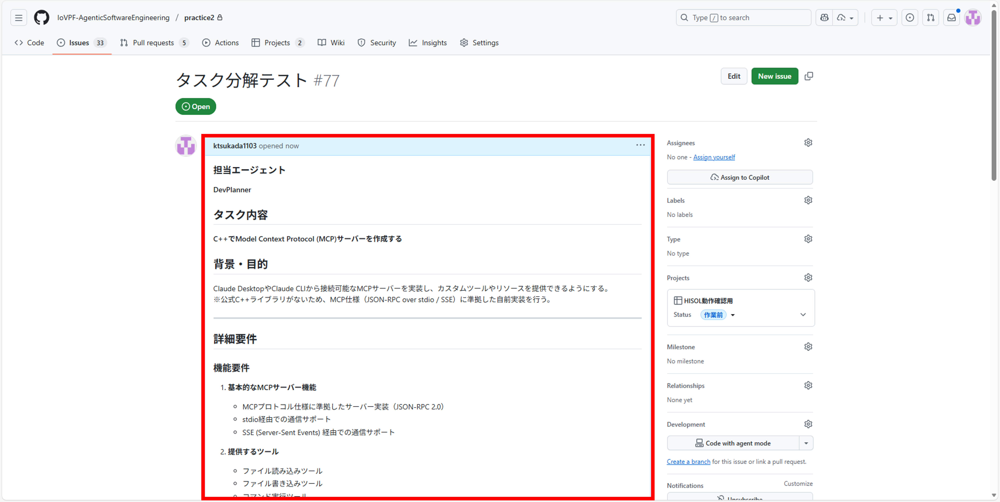

## 2. DevPlannerについて<!-- omit in toc -->

この章ではDevPlannerの機能と実装方針についてまとめる。

### 注意点<!-- omit in toc -->
**AIエージェントは2025年12月初旬にAgentCoreを使用する方針に変更となった。現在はAIエージェントの実装方針は検討中であり、以下の内容や（TBD）箇所は今後変更となる可能性がある。**  
**ただし、今後の検討でAgentCoreが使用できないAIエージェント呼び出しが発生した場合は、既存案を採用する可能性がある。**  
AgentCoreについては以下のGitHubリポジトリを参照のこと:  
https://github.com/IoVPF-AgenticSoftwareEngineering/dora2


### 目次<!-- omit in toc -->

- [2.1. DevPlannerの概要](#21-devplannerの概要)
- [2.2. 主な機能](#22-主な機能)
- [2.2.1. DevPlannerが動作する条件](#221-devplannerが動作する条件)
- [2.2.2. DevPlannerのワークフローと外部参照ファイルについて](#222-devplannerのワークフローと外部参照ファイルについて)
- [2.3. タスクについて](#23-タスクについて)
- [2.3.1. タスク概要](#231-タスク概要)
- [2.3.2. 分解後のタスクイメージ](#232-分解後のタスクイメージ)
- [2.4. DevPlannerの動作方法](#24-devplannerの動作方法)
  - [2.4.1. 事前準備](#241-事前準備)
    - [格納ファイル一覧（GitHubリポジトリ）](#格納ファイル一覧githubリポジトリ)
    - [配置階層（例）](#配置階層例)
  - [2.4.2. 実行方法](#242-実行方法)
  - [2.4.3. 動作結果](#243-動作結果)
- [2.5. 今後実装する予定の機能:（TBD）](#25-今後実装する予定の機能tbd)

### 2.1. DevPlannerの概要
DevPlannerは、GitHub Issueを起点にタスク分解・管理を自動化するワークフローを提供する。そしてタスクの内容やStatusをもとに、AIエージェント起動（TBD）を実現する。

参考ワークフロー: `./.github/workflows/DevPlanner.yml`

主な特徴:
- トリガー: `workflow_dispatch(inputs.issue_number)`, `issues: [opened, edited, labeled]`
- 権限: `id-token: write`(AWS OIDC), `contents: read`, `issues: write`
- ジョブ: `decompose-task`（タスク分解と後続ジョブへの出力伝搬）

### 2.2. 主な機能
- タスク分解
  - Issueの内容を判定し、DevPlannerのタスク分解対象か判別する。
  - Issueを取得し、タスクを分解する。
- AIエージェント起動（TBD）
  - AWS OIDC認証を行う。
  - 分解したタスクごとに、6種類のAIエージェント（Requirements Analyst, System Architect, Software Coder, Test Developer, Code Reviewer, Documentation Writer）へ個別にタスクを割り当てる。
  - MCPサーバー経由でAIエージェントを起動・実行する。
- ステータス更新
  - 実行開始時にProjects v2の`Status`を「作業前/Not Started」から「作業中/In Progress」に更新する（Step 6.5で実施、`GH_PAT_PROJECTS`未設定時はスキップ）。
  - 更新失敗時は通知し、再試行（リトライ方針）を検討する。

### 2.2.1. DevPlannerが動作する条件
GitHub Issueが以下の条件を満たす場合に、DevPlannerがタスク分解・AIエージェント起動を実行する。
1. Statusが「作業前」または「Not Started」に設定されている
2. 担当エージェントが「DevPlanner」または「Director Agent」に設定されている  
    記載例: 
```text
      ### 担当エージェント
      **DevPlanner**
```

### 2.2.2. DevPlannerのワークフローと外部参照ファイルについて
本節では、DevPlannerのワークフロー定義と、実行時に参照する外部ファイルの概要を記載する。

DevPlanner GitHubActionsワークフロー:
- `.github/workflows/DevPlanner.yml`: Issueを起点にタスク分解を行い、必要に応じて後続ジョブへ出力を引き渡す。

外部参照ファイル（リポジトリ内）:
- `.github/templates/task_template.md`: タスク分解用のプロンプトテンプレート
- `.github/config/devplanner_allowed_actors.txt`: 実行者ホワイトリスト（`ALLUSER`で全許可、未配置時は全員許可）
- `.github/script/extract_tasks.py`: Claude出力からタスク構造を抽出するスクリプト

生成/保存される主な成果物（Artifacts/出力ファイル）:
- `tasks.json`: 分解後タスクのJSON一覧
- `tasks_matrix.json`: 後続並列実行用のマトリクス（TBDの`dispatch-tasks`で使用想定）
- `raw_output.txt`: Claudeの生出力ログ

備考:
- Projects v2 の`Status`フィールドを利用するため、対象IssueがProjects v2に紐付いている必要がある。
- `GH_PAT_PROJECTS`を設定しない場合、`Status`更新ステップはスキップされる。


### 2.3. タスクについて

### 2.3.1. タスク概要
GitHub Issueに記載されるタスクは、以下のような内容を想定している。

```text
### 担当エージェント
**DevPlanner**

## タスク内容
**C++でModel Context Protocol (MCP)サーバーを作成する**

## 背景・目的
Claude DesktopやClaude CLIから接続可能なMCPサーバーを実装し、カスタムツールやリソースを提供できるようにする。  
※公式C++ライブラリがないため、MCP仕様（JSON-RPC over stdio / SSE）に準拠した自前実装を行う。

---

## 詳細要件

### 機能要件
1. **基本的なMCPサーバー機能**
   - MCPプロトコル仕様に準拠したサーバー実装（JSON-RPC 2.0）
   - stdio経由での通信サポート
   - SSE (Server-Sent Events) 経由での通信サポート

2. **提供するツール**
   - ファイル読み込みツール
   - ファイル書き込みツール
   - コマンド実行ツール
   - データベース操作ツール（SQLite）

3. **提供するリソース**
   - プロジェクト構造の情報
   - 設定ファイルの内容
   - ログファイルへのアクセス

4. **エラーハンドリング**
   - 不正なリクエストの処理
   - タイムアウト処理
   - 適切なエラーメッセージの返却

---

### 技術要件
- **言語**: C++20以上
- **フレームワーク**: MCP仕様準拠の自前実装  
  - JSON処理: `nlohmann/json`  
  - HTTP/SSE: `Boost.Beast` または `cpp-httplib`
- **通信方式**: stdio / SSE
- **依存管理**: vcpkg または Conan
- **型チェック**: clang-tidy
- **リンター**: clang-tidy, cpplint
- **ビルド**: CMake
- **ログ**: spdlog
- **テスト**: GoogleTest

---

### 非機能要件
- **パフォーマンス**: レスポンスタイム1秒以内
- **セキュリティ**:  
  - ファイルアクセスはプロジェクトディレクトリ内に制限  
  - コマンド実行は許可リストで制御
- **ログ**: すべての操作をログ出力
- **テスタビリティ**: 単体テストカバレッジ80%以上

---

## 技術スタック
```yaml
language: C++20+
framework: none (MCP spec compliant custom implementation)
package_manager: vcpkg
testing: GoogleTest
type_checking: clang-tidy
linting: clang-tidy, cpplint
communication: stdio, SSE
```

### 2.3.2. 分解後のタスクイメージ
DevPlannerがタスク分解を実行すると、AIエージェント毎のタスクに分解される。
以下に分解後のタスクの例を記載する。

- 要件定義タスク（Requirements Analyst Agentへ割当）
```text
    {
      "message_type": "TASK_ASSIGNMENT",
      "from_agent": "devplanner-agent",
      "to_agent": "requirements-analyst-agent",
      "correlation_id": "issue-72-flow",
      "timestamp": "2025-12-08T00:00:00Z",
      "version": "1.0",
      "payload": {
        "task_id": "task-72-requirements",
        "issue_number": 72,
        "issue_title": "タスク分解(MCPサーバー作成4)",
        "agent_role": "requirements-analyst-agent",
        "task_description": "C++でModel Context Protocol (MCP)サーバーを作成するための要件定義書を作成してください。以下の項目を含めること: 1) MCPプロトコル仕様(JSON-RPC 2.0、stdio/SSE通信)の詳細要件、2) 提供ツール(ファイル読み書き、コマンド実行、SQLite操作)の機能仕様、3) 提供リソース(プロジェクト構造、設定ファイル、ログファイル)のアクセス要件、4) セキュリティ要件(ファイルアクセス制限、コマンド許可リスト、入力バリデーション)、5) 非機能要件(レスポンスタイム1秒以内、エラーハンドリング、ログ出力、テストカバレッジ80%以上)、6) 技術スタック詳細(C++20、nlohmann/json、Boost.Beast/cpp-httplib、vcpkg、GoogleTest、spdlog、clang-tidy)、7) 受け入れ基準の定義。公式C++ライブラリがないため自前実装が必要な点を考慮してください。",
        "input_documents": [],
        "output_dir": "AgentsDiv/Develop/requirements",
        "base_branch": "feature/Claude-AI-Div",
        "constraints": {
          "security_level": "high",
          "protocol_compliance": ["MCP", "JSON-RPC 2.0"],
          "cpp_standard": "C++20+",
          "test_coverage_target": 80
        }
      },
      "metadata": {
        "priority": "high",
        "retry_count": 0,
        "ttl_seconds": 3600
      }
    }
```

- 設計タスク（Design Agentへ割当）
```text
    {
      "message_type": "TASK_ASSIGNMENT",
      "from_agent": "devplanner-agent",
      "to_agent": "design-agent",
      "correlation_id": "issue-72-flow",
      "timestamp": "2025-12-08T00:00:00Z",
      "version": "1.0",
      "payload": {
        "task_id": "task-72-design",
        "issue_number": 72,
        "issue_title": "タスク分解(MCPサーバー作成4)",
        "agent_role": "design-agent",
        "task_description": "要件定義書に基づいて、C++ MCP サーバーの詳細設計を行ってください。以下を含めること: 1) アーキテクチャ設計(レイヤー構成、モジュール分割、通信フロー図)、2) クラス設計(MCPServer、JSONRPCHandler、StdioTransport、SSETransport、ToolRegistry、ResourceProvider、ErrorHandler等)、3) JSON-RPC 2.0メッセージフォーマット設計(リクエスト/レスポンス/エラー構造)、4) ツール実装設計(FileReader、FileWriter、CommandExecutor、SQLiteOperator)とAPIインターフェース、5) リソース提供設計(ProjectStructure、ConfigFile、LogFileAccess)、6) エラーハンドリング設計(エラーコード体系、タイムアウト処理)、7) セキュリティ設計(パス検証、コマンド許可リスト、入力サニタイゼーション)、8) ログ設計(spdlog使用、ログレベル、フォーマット)、9) データフロー図、10) CMake構成設計。",
        "input_documents": [
          "AgentsDiv/Develop/requirements"
        ],
        "output_dir": "AgentsDiv/Develop/design",
        "base_branch": "feature/Claude-AI-Div",
        "constraints": {
          "security_level": "high",
          "protocol_compliance": ["MCP", "JSON-RPC 2.0"],
          "cpp_standard": "C++20+"
        }
      },
      "metadata": {
        "priority": "high",
        "retry_count": 0,
        "ttl_seconds": 3600
      }
    }
```

- コーディングタスク（Coding Agentへ割当）
```text
    {
      "message_type": "TASK_ASSIGNMENT",
      "from_agent": "devplanner-agent",
      "to_agent": "coding-agent",
      "correlation_id": "issue-72-flow",
      "timestamp": "2025-12-08T00:00:00Z",
      "version": "1.0",
      "payload": {
        "task_id": "task-72-coding",
        "issue_number": 72,
        "issue_title": "タスク分解(MCPサーバー作成4)",
        "agent_role": "coding-agent",
        "task_description": "設計書に基づいてC++ MCP サーバーを実装してください。以下を実装すること: 1) MCPServerクラス(メインサーバークラス、初期化、起動、停止)、2) JSONRPCHandlerクラス(JSON-RPC 2.0パーサー、リクエスト処理、レスポンス生成、nlohmann/json使用)、3) StdioTransportクラス(標準入出力経由の通信)、4) SSETransportクラス(Server-Sent Events経由の通信、Boost.Beast or cpp-httplib使用)、5) ツール実装(FileReaderTool、FileWriterTool、CommandExecutorTool、SQLiteOperatorTool)、6) リソース実装(ProjectStructureResource、ConfigFileResource、LogFileResource)、7) ErrorHandlerクラス(エラーコード定義、エラーレスポンス生成、タイムアウト処理)、8) セキュリティ機能(パス検証、コマンド許可リスト、入力バリデーション)、9) ログ機能(spdlog統合)、10) CMakeLists.txt(vcpkg統合、依存関係管理)、11) Google Testによる単体テスト(カバレッジ80%以上)、12) clang-tidyによる静的解析対応。",
        "input_documents": [
          "AgentsDiv/Develop/design/"
        ],
        "output_requirements": {
          "source_files": "AgentsDiv/Develop/src_72/",
          "test_files": "AgentsDiv/Develop/test_72/",
          "git_branch": "feature/mcp-server-cpp",
          "due_date": "2025-12-15T23:59:59Z"
        },
        "development_language": "cpp",
        "base_branch": "feature/Claude-AI-Div",
        "constraints": {
          "security_level": "high",
          "protocol_compliance": ["MCP", "JSON-RPC 2.0"],
          "cpp_standard": "C++20+",
          "test_framework": "Google Test",
          "test_coverage_target": 80,
          "dependencies": ["nlohmann-json", "boost-beast", "spdlog", "sqlite3"],
          "package_manager": "vcpkg",
          "linting": ["clang-tidy", "cpplint"]
        }
      },
      "metadata": {
        "priority": "high",
        "retry_count": 0,
        "ttl_seconds": 3600
      }
    }
```

- テストタスク（Test Agentへ割当）
```text
    {
      "message_type": "TASK_ASSIGNMENT",
      "from_agent": "devplanner-agent",
      "to_agent": "test-agent",
      "correlation_id": "issue-72-flow",
      "timestamp": "2025-12-08T00:00:00Z",
      "version": "1.0",
      "payload": {
        "task_id": "task-72-testing",
        "issue_number": 72,
        "issue_title": "タスク分解(MCPサーバー作成4)",
        "agent_role": "test-agent",
        "task_description": "GitHubリポジトリからC++ MCP サーバーのソースコードを取得し、包括的なテストを実行してください。以下を実施すること: 1) 単体テスト実行(Google Test、カバレッジ80%以上確認)、2) 統合テスト(stdio通信テスト、SSE通信テスト、ツール動作テスト、リソースアクセステスト)、3) パフォーマンステスト(レスポンスタイム1秒以内確認)、4) セキュリティテスト(パストラバーサル攻撃、コマンドインジェクション、入力バリデーション)、5) エラーハンドリングテスト(不正リクエスト、タイムアウト、エッジケース)、6) 静的解析(clang-tidy実行)、7) テストレポート作成(Markdown形式、カバレッジレポート、パフォーマンス結果、セキュリティチェック結果)。",
        "branch": "feature/mcp-server-cpp",
        "base_branch": "feature/Claude-AI-Div",
        "task_details": {
          "target_branch": "feature/mcp-server-cpp",
          "base_branch": "feature/Claude-AI-Div",
          "test_types": ["unit", "integration", "performance", "security"],
          "coverage_required": true,
          "coverage_target": 80,
          "test_mode": "comprehensive",
          "github_repo": "IoVPF-AgenticSoftwareEngineering/AgenticSoftwareEngineering",
          "commits": [
            {
              "sha": "test-72",
              "message": "Test: Execute comprehensive tests for MCP server"
            }
          ]
        },
        "output_dir": "AgentsDiv/Develop/test/report",
        "constraints": {
          "timeout_minutes": 30,
          "build_system": "cmake",
          "package_manager": "vcpkg",
          "performance_threshold": "1s response time"
        }
      },
      "metadata": {
        "priority": "high",
        "retry_count": 0,
        "ttl_seconds": 1800
      }
    }
```

- レビュータスク（Review Agentへ割当）
```text
    {
      "message_type": "TASK_ASSIGNMENT",
      "from_agent": "devplanner-agent",
      "to_agent": "review-agent",
      "correlation_id": "issue-72-flow",
      "timestamp": "2025-12-08T00:00:00Z",
      "version": "1.0",
      "payload": {
        "task_id": "task-72-review",
        "issue_number": 72,
        "issue_title": "タスク分解(MCPサーバー作成4)",
        "agent_role": "review-agent",
        "task_description": "C++ MCP サーバーの実装について包括的なコードレビューを実行してください。以下の観点でレビューすること: 1) MCP仕様準拠性(JSON-RPC 2.0、stdio/SSE通信、ツール/リソースプロトコル)、2) C++コード品質(C++20機能活用、RAII、スマートポインタ、例外安全性、const正確性)、3) アーキテクチャ妥当性(モジュール分割、依存関係、拡張性)、4) セキュリティ(パス検証実装、コマンド許可リスト、入力バリデーション、SQLインジェクション対策)、5) パフォーマンス(レスポンスタイム、メモリ管理、非効率な処理)、6) エラーハンドリング(エラーコード体系、タイムアウト処理、ログ出力)、7) テスト品質(カバレッジ80%達成、テストケース妥当性)、8) ビルド構成(CMake、vcpkg統合、依存関係管理)、9) 静的解析結果(clang-tidy警告)、10) コーディング規約準拠。レビュー結果をMarkdown形式で保存してください。",
        "pr_info": {
          "branch": "feature/mcp-server-cpp",
          "title": "C++ MCP サーバー実装",
          "description": "Model Context Protocol サーバーのC++実装"
        },
        "review_criteria": {
          "protocol_compliance": true,
          "code_quality": true,
          "security": true,
          "performance": true,
          "test_coverage": true,
          "architecture": true,
          "error_handling": true,
          "build_configuration": true
        },
        "output_dir": "AgentsDiv/Develop/review",
        "base_branch": "feature/Claude-AI-Div"
      },
      "metadata": {
        "priority": "high",
        "retry_count": 0,
        "ttl_seconds": 3600,
        "review_type": "automated",
        "requires_human_review": true
      }
    }
```

- ドキュメント作成タスク（Documentation Agentへ割当）
```text
    {
      "message_type": "TASK_ASSIGNMENT",
      "from_agent": "devplanner-agent",
      "to_agent": "documentation-agent",
      "correlation_id": "issue-72-flow",
      "timestamp": "2025-12-08T00:00:00Z",
      "version": "1.0",
      "payload": {
        "task_id": "task-72-documentation",
        "issue_number": 72,
        "issue_title": "タスク分解(MCPサーバー作成4)",
        "agent_role": "documentation-agent",
        "task_description": "C++ MCP サーバーの包括的なドキュメントを作成してください。以下を含めること: 1) README.md(プロジェクト概要、特徴、システム要件、インストール手順、クイックスタート、基本的な使用例)、2) INSTALL.md(詳細なインストール手順、vcpkg設定、依存関係インストール、ビルド手順、トラブルシューティング)、3) ARCHITECTURE.md(アーキテクチャ概要、モジュール構成、クラス図、通信フロー、データフロー)、4) API_REFERENCE.md(MCPServerクラス、ツールAPI、リソースAPI、エラーコード一覧)、5) MCP_PROTOCOL.md(JSON-RPC 2.0仕様、stdio通信プロトコル、SSE通信プロトコル、メッセージフォーマット例)、6) SECURITY.md(セキュリティ方針、脅威モデル、実装されたセキュリティ機能、ベストプラクティス)、7) DEVELOPMENT.md(開発環境構築、ビルド方法、テスト実行、デバッグ方法、コントリビューションガイドライン)、8) コード内Doxygenコメント、9) 使用例とサンプルコード。",
        "input_documents": [
          "AgentsDiv/Develop/requirements",
          "AgentsDiv/Develop/design",
          "AgentsDiv/Develop/src_72",
          "AgentsDiv/Develop/review"
        ],
        "output_dir": "AgentsDiv/Develop/docs",
        "base_branch": "feature/Claude-AI-Div",
        "constraints": {
          "documentation_format": "Markdown",
          "include_diagrams": true,
          "include_examples": true,
          "target_audience": ["developers", "integrators", "security_reviewers"]
        }
      },
      "metadata": {
        "priority": "high",
        "retry_count": 0,
        "ttl_seconds": 3600
      }
    }
```

### 2.4. DevPlannerの動作方法

#### 2.4.1. 事前準備
- 必要なファイルをGitHubリポジトリに配置する。（詳細は後述の「格納ファイル一覧」と「配置階層（例）」参照）
- GitHubリポジトリにて、OIDCを利用したAWSアクセス権限（`id-token: write`）を設定する。
 - GitHub Actionsの権限（Workflow permissions）を設定する。
   - `permissions`: `id-token: write`, `contents: read`, `issues: write`
 - リポジトリSecretsを登録する。
   - `AWS_ROLE_ARN`: OIDCでAssumeするロールARN
   - `AWS_REGION`: 例 `ap-northeast-1`
   - `GH_PAT_PROJECTS`: Projects v2 GraphQL用のPAT（Status取得・更新に必要）
 - 任意設定
   - `.github/config/devplanner_allowed_actors.txt`: 実行者ホワイトリスト（`ALLUSER`で全員許可、空ファイルは拒否、未配置時は全員許可）
   - Projects v2 の前提設定。
     - 対象Issueを Projects v2 に紐付ける。
     - SingleSelectフィールド「Status」に「作業前（Not Started）」と「作業中（In Progress）」のオプションを用意する（Status取得・更新で使用）。

##### 格納ファイル一覧（GitHubリポジトリ）
- `.github/workflows/DevPlanner.yml`（ワークフロー本体）
- `.github/templates/task_template.md`（タスク分解用テンプレート）
- `.github/config/devplanner_allowed_actors.txt`（任意: 実行者ホワイトリスト）
- `.github/script/extract_tasks.py`（Claude出力からタスク抽出）

##### 配置階層（例）
```text
repo-root/
├─ .github/
│  ├─ workflows/
│  │  └─ DevPlanner.yml
│  ├─ templates/
│  │  └─ task_template.md
│  ├─ config/
│  │  └─ devplanner_allowed_actors.txt
│  └─ script/
│     └─ extract_tasks.py
└─ （その他プロジェクトファイル）
```

#### 2.4.2. 実行方法
- 手動実行: `workflow_dispatch` で `issue_number` を指定して起動する。


- 自動実行: Issueのイベント（`opened`, `edited`, `labeled`）で起動する。




#### 2.4.3. 動作結果

- 実行結果（Actions）
  - `Action`タブで、DevPlannerワークフローの動作結果を確認できる。
1.png)
2.png)
3.png)

- 実行結果（Issue）
  - `Issue comment`で、以下について確認できる。
    - タスク分解結果
    - AIエージェント起動結果（TBD）
.png)


### 2.5. 今後実装する予定の機能:（TBD）
- ジョブ追加: `dispatch-tasks`を追加する。
- 実行条件: `tasks_count > 0（分解したタスクが1件以上存在する）` の場合にのみ起動する。
- 並列実行: `matrix: include = fromJSON(tasks_matrix)` で複数タスクを並列に処理する。
- Step概要:
  - Step 1: リポジトリのチェックアウト（`actions/checkout@v4`）
  - Step 2: タスク実行準備（開発中）
    - MCPサーバーの起動
    - エージェント環境設定
    - タスクの実行
    - 結果の収集と報告
  - Step 3: 実行ログ・成果物・エラー情報のArtifact保存
- 段階的実装項目（Placeholder）:
  - MCPサーバー起動と管理（`server.py`、ヘルスチェック、ポート設定）
  - AWS SSMによるエージェントEC2制御（インスタンスマッピング、SendCommand、結果取得）
  - 実行詳細制御（ロールフィルタリング、リージョン設定、リトライ）
  - 結果集約とレポート（Issue進捗報告、Artifact保存）


***

[目次](./01_はじめに.md#目次)
