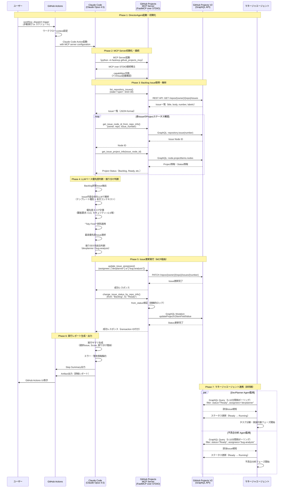
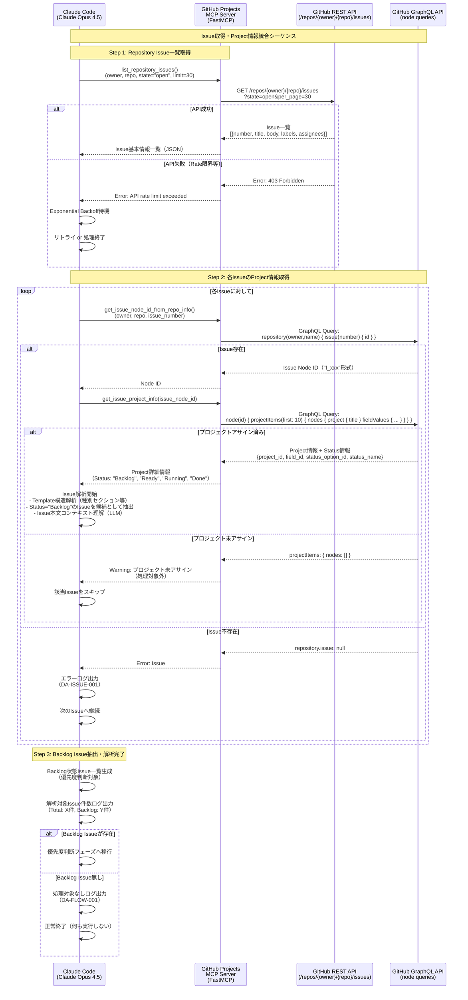
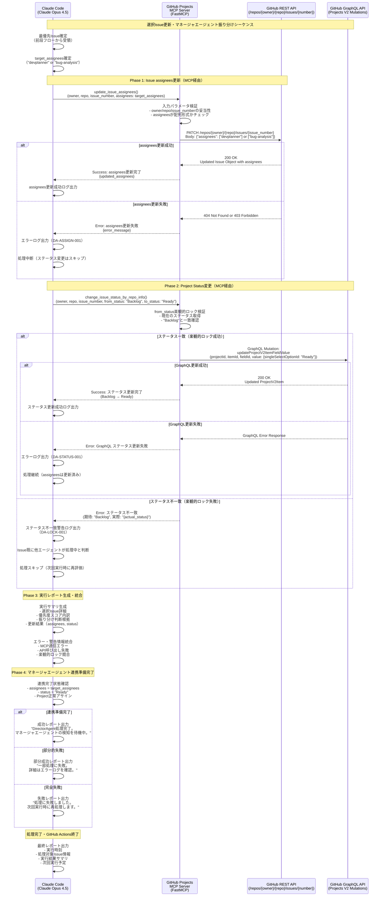

# 6. シーケンス図<!-- omit in toc -->

## 目次<!-- omit in toc -->

- [6.1. 概要](#61-概要)
- [6.2. 全体ワークフロー](#62-全体ワークフロー)
- [6.3. Issue取得フロー（MCP経由）](#63-issue取得フローmcp経由)
- [6.4. 優先度判断・振り分け判断フロー](#64-優先度判断振り分け判断フロー)
- [6.5. タスク振り分けフロー](#65-タスク振り分けフロー)
- [6.6. マネージャエージェント連携フロー](#66-マネージャエージェント連携フロー)
- [6.7. エラーハンドリングフロー](#67-エラーハンドリングフロー)
- [6.8. 移行計画](#68-移行計画)
- [6.9. 参考資料](#69-参考資料)

## 6.1. 概要

本章では、DirectorAgentの処理フローをシーケンス図で詳細に説明する。各フローは、Mermaid形式で記述している。

---

## 6.2. 全体ワークフロー

---

## 6.3. Issue取得フロー（MCP経由）

---

## 6.4. 優先度判断・振り分け判断フロー

```mermaid
sequenceDiagram
    participant CC as Claude Code<br/>(Claude Opus 4.5 LLM Engine)

    Note over CC: LLMベース優先度判断・振り分け判断シーケンス

    CC->>CC: Backlog Issue一覧受領<br/>（前段フローから）

    alt Backlog Issueが0件
        CC->>CC: 処理対象なしログ出力
        CC->>CC: 正常終了
    end

    Note over CC: Phase 1: Issue内容全体のLLM解析
    loop 各Backlog Issueに対して
        CC->>CC: Issue Template構造解析<br/>- "### 2. 種別" セクション抽出<br/>- "### 3. 要求" セクション抽出<br/>- "### 4. 背景・目的" セクション抽出<br/>- "### 5. スコープ" セクション抽出<br/>- "### 6. 要件" セクション抽出

        CC->>CC: Issue本文全体コンテキスト理解（LLM）<br/>- 意図・緊急度・影響範囲の意味理解<br/>- ビジネス価値・技術的複雑度の推定<br/>- 依存関係・前提条件の把握

        Note over CC: Phase 2: 優先度スコア計算（重み付きスコアリング）
        CC->>CC: ビジネス価値要因スコア計算
        CC->>CC: - 顧客要求チェック<br/>  （"顧客要求"記載有り → +3.0）
        CC->>CC: - ユーザー不満チェック<br/>  （"ユーザの不満"記載有り → +2.0）
        CC->>CC: - 市場ニーズチェック<br/>  （"市場ニーズ"記載有り → +1.5）

        CC->>CC: リスク・セキュリティ要因スコア計算
        CC->>CC: - セキュリティチェック<br/>  （種別=Security → +2.0）
        CC->>CC: - 不具合・バグチェック<br/>  （種別=Bug → +1.5）

        CC->>CC: 時間要因スコア計算
        CC->>CC: - Issue経過時間チェック<br/>  （30日以上 → +0.5, 60日以上 → +1.0）

        CC->>CC: "Tidy First?" 原則適用
        CC->>CC: - 小さな整理優先判定<br/>  （Refactor種別 + 小規模変更 → +0.3）

        CC->>CC: 総合スコア計算<br/>total_score = Σ(各要素スコア)

        Note over CC: Phase 3: タスク振り分け先判断（総合判断方式）
        CC->>CC: Issue種別フィールド確認
        CC->>CC: Issue全体コンテキスト分析（LLM）
        CC->>CC: 要求・背景・スコープ・要件の意味解析

        alt 不具合・バグ関連の判定
            CC->>CC: 種別="Bug" OR 本文に不具合関連キーワード
            CC->>CC: 振り分け先 = 不具合分析 Agents
            CC->>CC: target_assignees = ["bug-analysis"]
        else 開発・機能追加・改善の判定
            CC->>CC: 種別="Feature" OR "Enhancement" OR 本文内容が開発関連
            CC->>CC: 振り分け先 = DevPlanner Agents
            CC->>CC: target_assignees = ["devplanner"]
        else その他・曖昧な場合
            CC->>CC: 本文コンテキストから総合判断（LLM）
            CC->>CC: デフォルト = DevPlanner Agents
            CC->>CC: target_assignees = ["devplanner"]
        end

        CC->>CC: Issue解析結果格納<br/>{issue_id, score, target_assignees, reasoning}
    end

    Note over CC: Phase 4: 最優先Issue選択・決定
    CC->>CC: スコア降順ソート実行
    CC->>CC: 最高スコアIssue抽出

    alt 同点Issue複数存在
        CC->>CC: セカンダリソート：作成日時昇順<br/>（古いIssueを優先）
        CC->>CC: Tie-Break決定
    end

    Note over CC: Phase 5: 選択結果・判断理由生成
    CC->>CC: 最優先Issue確定
    CC->>CC: 判断理由詳細生成<br/>- スコア内訳<br/>- 振り分け根拠<br/>- ビジネス価値説明
    CC->>CC: 実行計画生成<br/>（次フェーズへの引き渡し情報）

    Note over CC: 選択完了・次フェーズへ
    CC->>CC: 選択Issue情報出力<br/>- Issue Number & Title<br/>- Total Score & 内訳<br/>- Target Assignees<br/>- Reasoning Detail<br/>- Next Action Plan
```

---

## 6.5. タスク振り分けフロー

---

## 6.6. マネージャエージェント連携フロー

```mermaid
sequenceDiagram
    participant DIR as DirectorAgent<br/>(GitHub Actions)
    participant GP_REST as GitHub REST API<br/>(Issues)
    participant GP_GraphQL as GitHub GraphQL API<br/>(Projects V2)
    participant DEV as DevPlanner Agents<br/>(assignees=devplanner)
    participant BUG as 不具合分析 Agents<br/>(assignees=bug-analysis)

    Note over DIR,BUG: DirectorAgent→Manager Agent非同期連携シーケンス

    Note over DIR,GP_GraphQL: DirectorAgent完了・連携準備
    DIR->>GP_REST: Issue assignees更新完了
    DIR->>GP_GraphQL: Project Status更新完了<br/>(Backlog → Ready)
    DIR->>DIR: GitHub Actions ワークフロー終了

    Note over GP_GraphQL,BUG: Manager Agent監視・検知フェーズ（並行実行）

    par DevPlanner Agents監視ループ（5-10分間隔）
        loop ポーリング監視
            DEV->>GP_GraphQL: GraphQL Query:<br/>projectV2(number: PROJECT_NUMBER) {<br/>  items(first: 50) {<br/>    nodes {<br/>      content { ... on Issue { number, assignees } }<br/>      fieldValues { ... on ProjectV2ItemFieldSingleSelectValue { name } }<br/>    }<br/>  }<br/>}

            alt GitHub API成功
                GP_GraphQL-->>DEV: Project Items一覧<br/>（Issue + Status + Assignees情報）
                DEV->>DEV: フィルタリング実行<br/>- Status = "Ready"<br/>- assignees contains "devplanner"<br/>- Issue type ≠ closed

                alt 該当Issue検出
                    DEV->>DEV: 対象Issue情報抽出<br/>(issue_number, title, content)
                    DEV->>DEV: DevPlanner実行可能性判定<br/>- 他Issue処理中でない<br/>- リソース利用可能

                    alt 実行条件満足
                        DEV->>GP_GraphQL: GraphQL Mutation:<br/>updateProjectV2ItemFieldValue<br/>(Ready → Running)
                        GP_GraphQL-->>DEV: Status更新完了
                        DEV->>DEV: DevPlanner Agent実行開始<br/>- Issue詳細分析<br/>- タスク分解・計画立案<br/>- 実装方針決定
                        Note over DEV: DevPlanner処理フェーズ開始<br/>（別シーケンスで詳細化）
                    else 実行条件未満足
                        DEV->>DEV: 待機継続<br/>（他Issue完了まで）
                    end

                else 該当Issue無し
                    DEV->>DEV: 待機状態維持<br/>（次回ポーリングまで5-10分）
                end

            else GitHub API失敗
                GP_GraphQL-->>DEV: Error Response<br/>(Rate Limit, Network Error etc.)
                DEV->>DEV: Exponential Backoff待機<br/>（次回ポーリング時間調整）
            end
        end

    and 不具合分析 Agents監視ループ（5-10分間隔）
        loop ポーリング監視
            BUG->>GP_GraphQL: GraphQL Query:<br/>projectV2(number: PROJECT_NUMBER) {<br/>  items(first: 50) {<br/>    nodes {<br/>      content { ... on Issue { number, assignees } }<br/>      fieldValues { ... on ProjectV2ItemFieldSingleSelectValue { name } }<br/>    }<br/>  }<br/>}

            alt GitHub API成功
                GP_GraphQL-->>BUG: Project Items一覧<br/>（Issue + Status + Assignees情報）
                BUG->>BUG: フィルタリング実行<br/>- Status = "Ready"<br/>- assignees contains "bug-analysis"<br/>- Issue type ≠ closed

                alt 該当Issue検出
                    BUG->>BUG: 対象Issue情報抽出<br/>(issue_number, title, content)
                    BUG->>BUG: 不具合分析実行可能性判定<br/>- 他Issue処理中でない<br/>- 分析リソース利用可能

                    alt 実行条件満足
                        BUG->>GP_GraphQL: GraphQL Mutation:<br/>updateProjectV2ItemFieldValue<br/>(Ready → Running)
                        GP_GraphQL-->>BUG: Status更新完了
                        BUG->>BUG: 不具合分析 Agent実行開始<br/>- 不具合詳細分析<br/>- 根本原因調査<br/>- 修正方針決定
                        Note over BUG: 不具合分析処理フェーズ開始<br/>（別シーケンスで詳細化）
                    else 実行条件未満足
                        BUG->>BUG: 待機継続<br/>（リソース確保まで）
                    end

                else 該当Issue無し
                    BUG->>BUG: 待機状態維持<br/>（次回ポーリングまで5-10分）
                end

            else GitHub API失敗
                GP_GraphQL-->>BUG: Error Response<br/>(Rate Limit, Network Error etc.)
                BUG->>BUG: Exponential Backoff待機<br/>（次回ポーリング時間調整）
            end
        end
    end

    Note over DIR,BUG: 連携完了・次サイクル準備
    Note over DEV,BUG: Manager Agents処理継続中<br/>（DirectorAgentは次回スケジュール実行まで待機）
```

---

## 6.7. エラーハンドリングフロー

```mermaid
sequenceDiagram
    participant CC as Claude Code<br/>(Claude Opus 4.5)
    participant MCP as GitHub Projects<br/>MCP Server<br/>(FastMCP)
    participant GP_REST as GitHub REST API
    participant GP_GraphQL as GitHub GraphQL API
    participant LOG as GitHub Actions<br/>Log System

    Note over CC,LOG: DirectorAgent総合エラーハンドリングシーケンス

    Note over CC,MCP: Phase 1: MCP Server接続エラーハンドリング
    CC->>MCP: MCP Server起動要求<br/>(python -m fastmcp github_projects_mcp)

    alt MCP Server起動失敗
        MCP-->>CC: Process Start Error<br/>(ModuleNotFoundError, etc.)
        CC->>LOG: Critical Error Log出力<br/>Code: DA-MCP-001<br/>Message: "MCP Server起動に失敗しました"
        CC->>CC: 緊急時フォールバック検討<br/>- Direct GitHub API使用<br/>- 処理スキップ
        CC->>CC: GitHub Actions失敗終了<br/>(exit code: 1)
    end

    CC->>MCP: MCP over STDIO接続確立

    alt MCP通信エラー
        MCP-->>CC: STDIO Communication Error
        CC->>LOG: Error Log出力<br/>Code: DA-MCP-002<br/>Message: "MCP通信に失敗しました"
        CC->>CC: 接続リトライ（最大3回）
        alt リトライ成功
            CC->>CC: 処理継続
        else リトライ失敗
            CC->>CC: 処理終了
        end
    end

    Note over CC,GP_REST: Phase 2: GitHub API呼び出しエラーハンドリング
    CC->>MCP: list_repository_issues()<br/>(owner, repo, state="open")
    MCP->>GP_REST: GET /repos/{owner}/{repo}/issues

    alt GitHub REST API失敗
        GP_REST-->>MCP: Error Response<br/>(403 Forbidden, 404 Not Found, 500 Server Error)
        MCP-->>CC: API Error Response<br/>{status_code, error_message}

        alt Rate Limit超過 (403)
            CC->>LOG: Warning Log出力<br/>Code: DA-API-001<br/>Message: "GitHub API Rate制限に到達"
            CC->>CC: Rate Reset時刻取得<br/>（X-RateLimit-Reset Header）
            CC->>CC: Exponential Backoff待機<br/>（初回: 60秒, 最大: 15分）
            CC->>CC: リトライ実行（最大5回）
        else 認証エラー (401)
            CC->>LOG: Critical Error Log出力<br/>Code: DA-API-002<br/>Message: "GitHub認証に失敗"
            CC->>CC: GitHub Actions Secret確認指示
            CC->>CC: 処理終了
        else Repository不存在 (404)
            CC->>LOG: Error Log出力<br/>Code: DA-API-003<br/>Message: "対象リポジトリが見つかりません"
            CC->>CC: Repository設定確認指示
            CC->>CC: 処理終了
        else その他APIエラー (5xx等)
            CC->>LOG: Error Log出力<br/>Code: DA-API-004<br/>Message: "GitHub API一時的エラー"
            CC->>CC: Exponential Backoff待機
            CC->>CC: リトライ実行（最大3回）
        end
    end

    Note over CC,GP_GraphQL: Phase 3: GraphQL操作エラーハンドリング
    CC->>MCP: change_issue_status_by_repo_info()<br/>(from: "Backlog", to: "Ready")
    MCP->>MCP: from_status楽観的ロック検証

    alt ステータス不一致（楽観的ロック失敗）
        MCP->>GP_GraphQL: 現在ステータス取得
        GP_GraphQL-->>MCP: current_status = "Running"
        MCP-->>CC: Optimistic Lock Failed<br/>(期待: "Backlog", 実際: "Running")
        CC->>LOG: Warning Log出力<br/>Code: DA-LOCK-001<br/>Message: "Issue#{number} は既に他エージェントが処理中"
        CC->>CC: Issue競合状況記録
        CC->>CC: 次Issue候補へスキップ<br/>（同一サイクル内で別Issue選択）
    end

    MCP->>GP_GraphQL: GraphQL Mutation<br/>updateProjectV2ItemFieldValue

    alt GraphQL操作失敗
        GP_GraphQL-->>MCP: GraphQL Error Response<br/>{errors: [{message, path}]}
        MCP-->>CC: GraphQL Operation Failed

        alt Project未存在エラー
            CC->>LOG: Error Log出力<br/>Code: DA-PROJECT-001<br/>Message: "GitHub Projectsが見つかりません"
            CC->>CC: Project設定確認指示
            CC->>CC: 処理終了
        else Field未存在エラー
            CC->>LOG: Error Log出力<br/>Code: DA-PROJECT-002<br/>Message: "Statusフィールドが見つかりません"
            CC->>CC: Project構成確認指示
            CC->>CC: 処理終了
        else その他GraphQLエラー
            CC->>LOG: Error Log出力<br/>Code: DA-GRAPHQL-001<br/>Message: "GraphQL操作に失敗"
            CC->>CC: リトライ実行（最大2回）
        end
    end

    Note over CC,LOG: Phase 4: Issue解析・LLM処理エラーハンドリング
    CC->>CC: Issue Template解析<br/>（LLM based parsing）

    alt Template解析失敗
        CC->>CC: 必須セクション欠損検出<br/>（"### 2. 種別" セクションなし等）
        CC->>LOG: Warning Log出力<br/>Code: DA-PARSE-001<br/>Message: "Issue#{number} のテンプレート解析に失敗"
        CC->>CC: Issue解析結果に警告フラグ追加
        CC->>CC: デフォルト種別適用<br/>（種別: "Unknown" → DevPlanner振り分け）
    end

    CC->>CC: LLM優先度判断実行

    alt LLM処理エラー
        CC->>CC: Claude API呼び出し失敗検出
        CC->>LOG: Error Log出力<br/>Code: DA-LLM-001<br/>Message: "LLM優先度判断に失敗"
        CC->>CC: フォールバック優先度計算<br/>（ルールベース簡易計算）
        CC->>CC: 処理継続（精度低下を許容）
    end

    Note over CC,LOG: Phase 5: 統合エラー処理・レポート生成
    CC->>CC: 全エラー・警告情報統合
    CC->>CC: 処理結果サマリ生成<br/>- 成功操作数<br/>- エラー操作数<br/>- 警告件数<br/>- 推奨アクション

    alt 致命的エラー発生
        CC->>LOG: Critical Summary出力<br/>"DirectorAgent実行に失敗しました"
        CC->>CC: 次回実行への改善提案出力
        CC->>CC: GitHub Actions 失敗終了
    else 部分的成功
        CC->>LOG: Warning Summary出力<br/>"一部処理でエラーが発生しましたが継続可能です"
        CC->>CC: GitHub Actions 成功終了<br/>(warning付き)
    else 完全成功
        CC->>LOG: Success Summary出力<br/>"DirectorAgent正常完了"
        CC->>CC: GitHub Actions 成功終了
    end
```

---

## 6.8. 移行計画

> **⚠️ 注記**: 本移行計画は暫定であり、実際の進捗やプロジェクト状況に応じて調整する予定です。各フェーズの完了条件や実装順序は、運用開始後のフィードバックに基づいて見直しを行います。

### Phase 1: DirectorAgent基本機能実装（手動実行フェーズ）

**期間**: 実装開始から基本機能完成まで

**実装順序・依存関係**:
1. **GitHub Actions基盤整備**
   - [ ] `.github/workflows/director-agent.yml` 作成
   - [ ] Claude Code Action（v1.x）導入・設定
   - [ ] GitHub Actions Secrets設定（`GITHUB_TOKEN`, `ANTHROPIC_API_KEY`）
   - [ ] workflow_dispatch手動実行トリガー設定

2. **MCP Server統合基盤**
   - [ ] FastMCP github_projects_mcp.py配置・動作確認
   - [ ] MCP over STDIO通信テスト
   - [ ] 7つのMCPツール動作検証（list_repository_issues等）
   - [ ] エラーハンドリング基本実装

3. **Issue解析・優先度判断ロジック**
   - [ ] Issue Template解析エンジン実装（LLMベース）
   - [ ] 優先度スコア計算ロジック（重み付きスコアリング）
   - [ ] "Tidy First?" 原則適用ロジック
   - [ ] タスク振り分け判断ロジック（総合判断方式）

4. **GitHub Projects更新処理**
   - [ ] assignees更新処理（update_issue_assignees）
   - [ ] ステータス変更処理（change_issue_status_by_repo_info）
   - [ ] 楽観的ロック実装（from_status検証）
   - [ ] トランザクション整合性確保

5. **実行レポート・ログ出力**
   - [ ] 実行サマリ生成（選択Issue、スコア内訳等）
   - [ ] GitHub Actions Step Summary出力
   - [ ] エラー・警告ログ体系化（エラーコード付き）
   - [ ] Artifact出力（詳細レポート）

**完了条件**:
- 手動実行でBacklog Issue→Ready Issue変換が正常動作
- エラーハンドリングが適切に機能
- 実行レポートが期待通り出力

### Phase 2: 定期実行・スケジュール実装（安定運用フェーズ）

**期間**: Phase 1完了後から自動化完成まで

**実装順序・依存関係**:
1. **スケジュール実行基盤**
   - [ ] cron trigger設定（`.github/workflows/director-agent.yml`）
   - [ ] 実行頻度調整機能（環境変数による制御）
   - [ ] 複数実行防止機能（concurrency制御）

2. **マネージャエージェント状況監視**
   - [ ] DevPlanner Agents稼働状況確認ロジック
   - [ ] 不具合分析 Agents稼働状況確認ロジック
   - [ ] リソース使用状況判定（並行処理数制限）

3. **自動実行条件判定**
   - [ ] Backlog Issue存在確認
   - [ ] マネージャエージェント空き状況判定
   - [ ] システム負荷状況考慮
   - [ ] 実行スキップ条件実装

4. **統合テスト・安定化**
   - [ ] 長時間動作テスト（24時間継続実行）
   - [ ] エラー耐性テスト（API障害シミュレート）
   - [ ] パフォーマンス測定・最適化

**完了条件**:
- スケジュール定期実行が安定動作
- マネージャエージェント連携が円滑
- エラー発生時の自動復旧が機能

### Phase 3: 自動実行・完全自動化（統合運用フェーズ）

**期間**: Phase 2完了後から統合運用開始まで

**実装順序・依存関係**:
1. **Manager Agent実装・配置**
   - [ ] DevPlanner Agents実装完了・デプロイ
   - [ ] 不具合分析 Agents実装完了・デプロイ
   - [ ] 各AgentのGitHub Projects監視機能実装

2. **ステータス遷移整合性確保**
   - [ ] DirectorAgent→Manager Agent状態遷移テスト
   - [ ] 競合状態解決機能（楽観的ロック）
   - [ ] Issue処理フロー完全自動化テスト
   - [ ] ロールバック・復旧手順確立

3. **End-to-End統合テスト**
   - [ ] Issue登録→振り分け→処理完了の全自動フローテスト
   - [ ] 複数Issue並行処理テスト
   - [ ] 異常系シナリオテスト（Manager Agent障害等）
   - [ ] パフォーマンス・スループット測定

4. **運用監視・メンテナンス体制**
   - [ ] ダッシュボード・監視システム構築
   - [ ] アラート・通知機能実装
   - [ ] バックアップ・復旧手順文書化
   - [ ] 運用マニュアル作成

**完了条件**:
- Issue登録から処理完了まで完全自動化
- 運用監視体制確立
- メンテナンス手順文書化完了

### 各Phase間の移行判定基準

**Phase 1 → Phase 2移行条件**:
- 手動実行成功率 95%以上
- 全エラーパターンでの適切なハンドリング確認
- レポート出力品質が要求水準達成

**Phase 2 → Phase 3移行条件**:
- 自動実行成功率 90%以上
- マネージャエージェント基本連携動作確認
- システム負荷・リソース使用量が許容範囲内

**Phase 3完了条件**:
- End-to-End自動化成功率 85%以上
- 運用監視体制構築完了
- 障害発生時の自動復旧率 80%以上

---

## 6.9. 参考資料

### 6.9.1. 内部参照ドキュメント

- [Tidy First?　―個人で実践する経験主義的ソフトウェア設計](https://www.oreilly.co.jp/books/9784814400911/)
- [GitHub Projects MCP Server実装](./mcp_tool/github_projects_mcp.py)
- [Issueテンプレート](./issue_template/template.md)
- [01_はじめに.md](./01_はじめに.md) - DirectorAgent基本方針・技術スタック
- [02_DirectorAgentの概要.md](./02_DirectorAgentの概要.md) - 詳細設計・アーキテクチャ
- [03_機能要件.md](./03_機能要件.md) - 機能要件詳細
- [04_非機能要件.md](./04_非機能要件.md) - 性能・可用性要件
- [05_エージェント間インターフェース.md](./05_エージェント間インターフェース.md) - MCP連携仕様

### 6.9.2. 外部技術ドキュメント

- [GitHub GraphQL API Documentation](https://docs.github.com/en/graphql) - Projects V2 API仕様
- [GitHub REST API Documentation](https://docs.github.com/en/rest) - Issues API仕様
- [GitHub Actions Documentation](https://docs.github.com/en/actions) - ワークフロー・Action仕様
- [Claude Code Documentation](https://docs.anthropic.com/claude-code) - Claude Code使用方法
- [FastMCP Framework Documentation](https://github.com/jlowin/fastmcp) - MCP Server実装フレームワーク
- [Model Context Protocol (MCP)](https://modelcontextprotocol.io/) - MCP通信プロトコル仕様

### 6.9.3. シーケンス図表記規則

本ドキュメントのMermaidシーケンス図では、以下の表記規則を採用：

- **Participant名**: 役割・技術要素を併記（例: `Claude Code (Claude Opus 4.5)`）
- **Note**: フェーズ・処理ステップを明示（例: `Phase 1: 初期化`）
- **alt/else**: 成功・失敗パターン・エラーハンドリングを表現
- **loop**: 反復処理（Issue処理ループ等）を表現
- **par/and**: 並行処理（Manager Agent監視等）を表現

### 6.9.4. エラーコード体系

DirectorAgentで使用するエラーコード分類：

- `DA-MCP-xxx`: MCP Server関連エラー
- `DA-API-xxx`: GitHub API関連エラー
- `DA-PROJECT-xxx`: GitHub Projects関連エラー
- `DA-GRAPHQL-xxx`: GraphQL操作関連エラー
- `DA-LOCK-xxx`: 楽観的ロック・競合関連エラー
- `DA-PARSE-xxx`: Issue解析・LLM処理関連エラー
- `DA-ASSIGN-xxx`: assignees更新関連エラー
- `DA-STATUS-xxx`: ステータス更新関連エラー
- `DA-FLOW-xxx`: 全体フロー関連警告・情報

[目次](./01_はじめに.md#はじめに)
