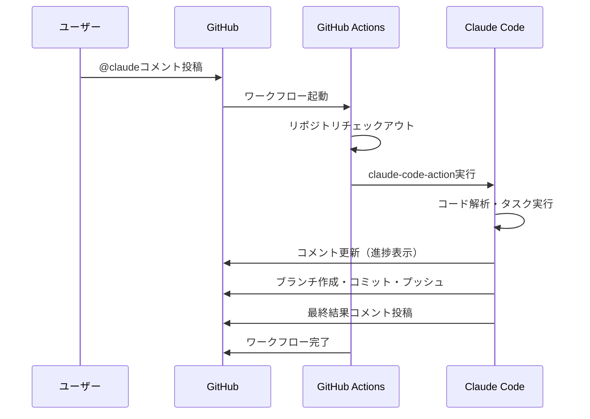

# 2. GitHubActionsの動作の実態<!-- omit in toc -->

GitHub Actionsでclaude-code-actionを使用した場合の動作仕様について記載する。

## 目次<!-- omit in toc -->

- [2.1. 概要](#21-概要)
- [2.2. ワークフローの構成](#22-ワークフローの構成)
  - [2.2.1. 基本構造](#221-基本構造)
  - [2.2.2. 主要なパラメータ](#222-主要なパラメータ)
- [2.3. トリガーイベント](#23-トリガーイベント)
  - [2.3.1. 対応イベント一覧](#231-対応イベント一覧)
  - [2.3.2. イベント別の動作](#232-イベント別の動作)
- [2.4. 実行環境](#24-実行環境)
  - [2.4.1. ランナー環境](#241-ランナー環境)
  - [2.4.2. 制限事項](#242-制限事項)
- [2.5. 認証方式](#25-認証方式)
  - [2.5.1. API認証](#251-api認証)
  - [2.5.2. GitHub認証](#252-github認証)
- [2.6. 動作フロー](#26-動作フロー)

## 2.1. 概要

GitHub ActionsのClaude Code（claude-code-action）は、GitHubのイベントをトリガーとしてClaude AIを実行するGitHub Actionである。Issue/PRのコメントで`@claude`をメンションすることで、Claudeが自動的にタスクを処理する。

## 2.2. ワークフローの構成

### 2.2.1. 基本構造

```yaml
name: Claude Code Action

on:
  issue_comment:
    types: [created]
  pull_request_review_comment:
    types: [created]
  issues:
    types: [opened, assigned]
  pull_request:
    types: [opened, synchronize]

jobs:
  claude:
    if: |
      (github.event_name == 'issue_comment' && contains(github.event.comment.body, '@claude')) ||
      (github.event_name == 'pull_request_review_comment' && contains(github.event.comment.body, '@claude')) ||
      (github.event_name == 'issues') ||
      (github.event_name == 'pull_request')
    runs-on: ubuntu-latest
    permissions:
      contents: write
      pull-requests: write
      issues: write
      id-token: write
    steps:
      - name: Run Claude
        uses: anthropics/claude-code-action@v1
        with:
          anthropic_api_key: ${{ secrets.ANTHROPIC_API_KEY }}
```

### 2.2.2. 主要なパラメータ

| パラメータ | 説明 | 必須 |
|-----------|------|------|
| `anthropic_api_key` | Anthropic APIキー | はい（Bedrock未使用時） |
| `use_bedrock` | AWS Bedrockを使用するか | いいえ |
| `aws_region` | AWSリージョン | Bedrock使用時 |
| `model` | 使用するClaudeモデル | いいえ |
| `timeout_minutes` | タイムアウト時間（分） | いいえ（デフォルト60） |
| `allowed_tools` | 許可するツールのリスト | いいえ |
| `disallowed_tools` | 禁止するツールのリスト | いいえ |
| `custom_instructions` | カスタム指示文 | いいえ |
| `direct_prompt` | 直接実行するプロンプト | いいえ |

> **注意**: 記載のモデルIDは2025年12月時点のものである。AWS Bedrockで使用可能なモデルは随時更新されるため、最新のモデルIDは[AWS公式ドキュメント](https://docs.aws.amazon.com/bedrock/)を参照すること。

**AWS Bedrock使用時の設定例**:
```yaml
- name: Run Claude
  uses: anthropics/claude-code-action@v1
  with:
    use_bedrock: true
    aws_region: us-east-1
  env:
    AWS_ACCESS_KEY_ID: ${{ secrets.AWS_ACCESS_KEY_ID }}
    AWS_SECRET_ACCESS_KEY: ${{ secrets.AWS_SECRET_ACCESS_KEY }}
```

**OIDC認証を使用したBedrock設定例**:
```yaml
- name: Configure AWS credentials
  uses: aws-actions/configure-aws-credentials@v4
  with:
    role-to-assume: ${{ secrets.AWS_ROLE_ARN }}
    aws-region: us-east-1

- name: Run Claude
  uses: anthropics/claude-code-action@v1
  with:
    use_bedrock: true
    aws_region: us-east-1
```

## 2.3. トリガーイベント

### 2.3.1. 対応イベント一覧

| イベント | 説明 | 典型的な用途 |
|---------|------|-------------|
| `issue_comment` | Issueへのコメント | `@claude`による指示 |
| `pull_request_review_comment` | PRレビューコメント | コードレビュー対応 |
| `issues` | Issue作成・更新 | 自動タスク処理 |
| `pull_request` | PR作成・更新 | 自動コードレビュー |
| `push` | プッシュイベント | 特定ブランチでの処理 |

### 2.3.2. イベント別の動作

**issue_comment（@claudeメンション時）**:
1. コメント内容からプロンプトを抽出
2. リポジトリをチェックアウト
3. Claude Codeが指示を実行
4. 結果をIssueコメントとして投稿
5. 必要に応じてブランチ作成、コミット、プッシュ

**pull_request（PR作成時）**:
1. PRの差分を取得
2. Claude Codeがコードレビューを実行
3. レビュー結果をPRコメントとして投稿
4. 必要に応じて修正コミットを作成

**issues（Issue作成時）**:
1. Issueの内容を解析
2. 自動的にタスクを開始
3. 結果をIssueコメントとして投稿

## 2.4. 実行環境

### 2.4.1. ランナー環境

| 項目 | 仕様 |
|-----|-----|
| OS | Ubuntu Latest（ubuntu-24.04） |
| CPU | 4コア |
| メモリ | 16GB |
| ストレージ | 14GB（SSD） |
| Node.js | 20.x |
| 実行時間上限 | 6時間（ジョブ単位） |

> **参考**: 上記はGitHub-hosted runnerの標準仕様（2025年12月時点）。最新の仕様は[GitHub公式ドキュメント](https://docs.github.com/ja/actions/using-github-hosted-runners/about-github-hosted-runners)を参照。

**注意**: GitHub Actionsランナーはステートレスであり、ジョブ終了後に環境は破棄される。

### 2.4.2. 制限事項

**時間制限**:
- ジョブタイムアウト: 最大6時間
- ワークフロータイムアウト: 最大35日（scheduled workflowsは除く）
- claude-code-actionのデフォルトタイムアウト: 60分

**リソース制限**:
- 同時実行ジョブ数: プランにより異なる（Free: 20、Pro: 40、Team: 60）
- APIレート制限: GitHub API、Claude APIそれぞれに制限あり

**機能制限**:
- インタラクティブな対話不可（コメントベースのみ）
- ローカルツールへのアクセス不可
- 外部ネットワークへのアクセスは可能だが、制限される場合あり

## 2.5. 認証方式

### 2.5.1. API認証

**Anthropic API直接使用**:
```yaml
with:
  anthropic_api_key: ${{ secrets.ANTHROPIC_API_KEY }}
```

**AWS Bedrock経由（IAM認証）**:
```yaml
env:
  AWS_ACCESS_KEY_ID: ${{ secrets.AWS_ACCESS_KEY_ID }}
  AWS_SECRET_ACCESS_KEY: ${{ secrets.AWS_SECRET_ACCESS_KEY }}
with:
  use_bedrock: true
```

**AWS Bedrock経由（OIDC認証）**:
```yaml
- uses: aws-actions/configure-aws-credentials@v4
  with:
    role-to-assume: ${{ secrets.AWS_ROLE_ARN }}
    aws-region: us-east-1
```

### 2.5.2. GitHub認証

claude-code-actionは自動的にGitHubトークンを使用する。以下の権限が必要：

```yaml
permissions:
  contents: write      # リポジトリの読み書き
  pull-requests: write # PRの作成・コメント
  issues: write        # Issueへのコメント
  id-token: write      # OIDC認証使用時
```

## 2.6. 動作フロー

以下にGitHub Actions版Claude Codeの動作フローを示す。

**動作フロー図**:



**リアルタイム更新機能**:
- Claude Codeは実行中にコメントをリアルタイムで更新
- タスクの進捗状況が可視化される
- 長時間タスクでも進捗確認が可能

***

[目次](./01_はじめに.md#目次)
