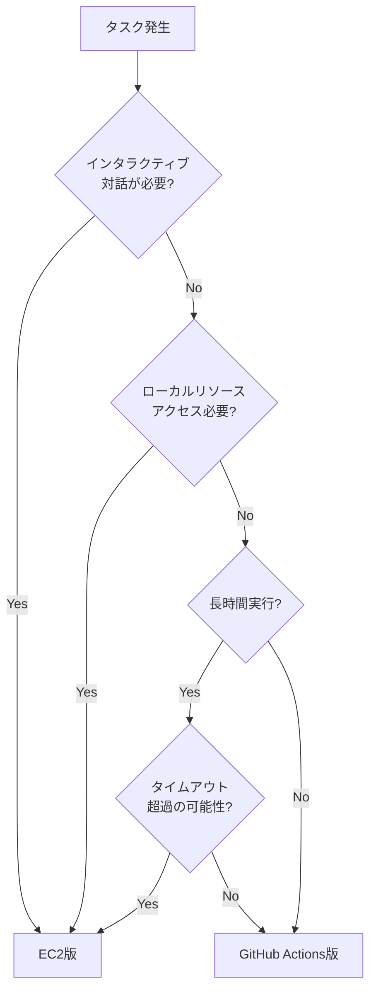

# 4. EC2上で使用するClaudeAgentSDKとの違い<!-- omit in toc -->

GitHub Actions版Claude CodeとEC2上で使用するClaudeAgentSDKの比較について記載する。

## 目次<!-- omit in toc -->

- [4.1. 概要](#41-概要)
- [4.2. GitHub Actions版Claude Codeの特徴](#42-github-actions版claude-codeの特徴)
  - [4.2.1. メリット](#421-メリット)
  - [4.2.2. デメリット](#422-デメリット)
- [4.3. EC2版Claude（ClaudeAgentSDK）の特徴](#43-ec2版claudeclaudeagentsdkの特徴)
  - [4.3.1. メリット](#431-メリット)
  - [4.3.2. デメリット](#432-デメリット)
- [4.4. 機能比較表](#44-機能比較表)
  - [4.4.1. 基本機能](#441-基本機能)
  - [4.4.2. 運用面](#442-運用面)
  - [4.4.3. コスト](#443-コスト)
- [4.5. 使い分け指針](#45-使い分け指針)
- [4.6. ハイブリッド運用の提案](#46-ハイブリッド運用の提案)

## 4.1. 概要

本章では、GitHub Actions版Claude CodeとEC2上でClaudeAgentSDKを使用する場合の違いを比較する。両者はそれぞれ異なる強みを持っており、用途に応じた使い分けが重要である。

| 観点 | GitHub Actions版 | EC2版（ClaudeAgentSDK） |
|-----|-----------------|----------------------|
| 実行方式 | イベント駆動 | 対話型/プログラム実行 |
| GitHub統合 | ネイティブ対応 | 手動設定が必要 |
| インフラ管理 | 不要 | 必要 |
| インタラクティブ性 | 低い（コメントベース） | 高い（リアルタイム対話） |
| 柔軟性 | 制限あり | 高い |

## 4.2. GitHub Actions版Claude Codeの特徴

### 4.2.1. メリット

**GitHub統合関連**:
- **GitHub操作がスムーズ**: Issue/PR/コメントへの自動応答、ブランチ作成、コミット、プッシュが完全に自動化
- **GitHub Appトークン管理**: 自動的に適切な権限で動作
- **イベント駆動型**: `@claude`メンションに自動反応、レビューコメントにも対応
- **PR作成リンク自動生成**: URLパラメータ付きのPR作成リンクを自動提供
- **コメント更新機能**: 同じコメントをリアルタイムで更新してタスク進捗を表示

**運用・インフラ関連**:
- **インフラ管理不要**: サーバー保守、OS更新、セキュリティパッチ適用が不要
- **スケーラビリティ**: 複数のIssue/PRに対して自動的に並列実行可能
- **コスト効率**: 実行時のみ課金（GitHub Actions + API使用分のみ）
- **バックグラウンド実行**: 業務終了後の夜間バッチ処理として実行可能
- **ステートレス**: 各実行が独立しているため、エラーが他の実行に影響しない
- **監査ログ**: すべての実行がGitHub Actionsのログに記録される
- **バージョン管理**: ワークフローファイル自体がGit管理されている

**セキュリティ**:
- **Secrets管理**: GitHub SecretsでAPIキーや認証情報を安全に管理
- **OIDC認証**: AWS認証にOIDCを使用し、長期的な認証情報が不要
- **権限制御**: 実行時に必要最小限の権限のみ付与（`allowedTools`で制限）

### 4.2.2. デメリット

**インタラクティブ性の欠如**:
- **対話が制限的**: コメントベースのやり取りのみ、リアルタイム対話は不可
- **フィードバックループが遅い**: コメント→実行→結果という非同期フロー
- **複雑な要件の伝達が困難**: 長い説明を一度にコメントに書く必要がある

**実行環境の制約**:
- **タイムアウト制限**: デフォルト60分（設定可能だが上限あり）
- **環境が一時的**: 実行後に環境が破棄される（キャッシュは可能）
- **デバッグが困難**: ログを見ることはできるが、途中介入できない
- **ローカルツールへのアクセス不可**: EC2上の特定のツールやデータベースにアクセスできない

**コスト**:
- **大量実行時のコスト**: 多数のIssue/PRで頻繁に実行するとGitHub Actions + API料金が増加

## 4.3. EC2版Claude（ClaudeAgentSDK）の特徴

### 4.3.1. メリット

**インタラクティブ性**:
- **リアルタイム対話**: その場で質問や要件を調整できる
- **フィードバックループが速い**: すぐに確認・修正・再実行が可能
- **段階的な開発**: 試行錯誤しながら進められる

**柔軟性**:
- **カスタム環境**: 必要なツール、ライブラリ、データベースを自由にセットアップ
- **ステートフル**: セッション間で状態を保持可能
- **長時間実行**: タイムアウトの心配なく、複雑なタスクを実行できる
- **ローカルリソースアクセス**: EC2上のファイル、データベース、内部APIにアクセス可能
- **サブエージェントの柔軟な構成**: AgentDefinitionによる動的なサブエージェント定義

**開発体験**:
- **即時デバッグ**: エラーが発生したらその場で確認・修正
- **探索的作業に適している**: コードベースの調査や試験的な変更が容易
- **プログラム的制御**: Pythonコードで実行フローを細かく制御可能

### 4.3.2. デメリット

**GitHub統合**:
- **手動操作が必要**: ブランチ作成、コミット、プッシュ、PR作成を手動で実行
- **認証管理が煩雑**: GitHub Personal Access Token (PAT)の管理が必要
- **Issue/PRへの自動応答不可**: コメントへの自動反応機能がない
- **複数Issue同時処理が困難**: 1セッションで1つのタスクに集中

**運用・インフラ**:
- **インフラ管理が必要**: EC2インスタンスの保守、OS更新、セキュリティパッチ適用
- **常時稼働コスト**: 使用していなくてもEC2インスタンスの料金が発生
- **スケーラビリティの欠如**: 複数人が使用する場合、インスタンス数を増やす必要
- **バックグラウンド実行の工夫が必要**: screen/tmuxなどを使用しないとSSH切断時に終了

**セキュリティ**:
- **認証情報の管理**: APIキーやトークンをEC2上に保存する必要（漏洩リスク）
- **アクセス制御**: EC2へのSSHアクセス管理が必要
- **監査ログ**: 実行履歴を自分で記録する必要

**その他**:
- **セットアップが必要**: Python環境、ClaudeAgentSDKのインストール、設定ファイル作成
- **チーム共有が困難**: 複数人で使用する場合の調整が必要

## 4.4. 機能比較表

### 4.4.1. 基本機能

**凡例**: ✅=対応 / ❌=非対応 / △=条件付き対応

| 機能 | GitHub Actions版 | EC2版 |
|-----|-----------------|------|
| リアルタイム対話 | ❌ | ✅ |
| GitHub自動応答 | ✅ | ❌ |
| 自動ブランチ作成 | ✅ | ❌（手動） |
| 自動コミット・プッシュ | ✅ | ❌（手動） |
| PR自動作成 | ✅ | ❌（手動） |
| サブエージェント | ✅（.claude/agents/） | ✅（AgentDefinition） |
| カスタムツール | 制限あり | 自由 |
| ローカルリソースアクセス | ❌ | ✅ |
| 長時間実行 | △（タイムアウトあり） | ✅ |
| 並列実行 | ✅（自動） | △（要実装） |

### 4.4.2. 運用面

| 項目 | GitHub Actions版 | EC2版 |
|-----|-----------------|------|
| インフラ管理 | 不要 | 必要 |
| セットアップ難易度 | 低 | 中〜高 |
| スケーラビリティ | 高い（自動） | 要設計 |
| 監査ログ | 自動 | 要実装 |
| バックグラウンド実行 | 標準対応 | screen/tmux必要 |
| チーム利用 | 容易 | 要調整 |
| バージョン管理 | Git統合 | 手動 |

### 4.4.3. コスト

| 項目 | GitHub Actions版 | EC2版 |
|-----|-----------------|------|
| 初期コスト | 低い | 中〜高 |
| 実行コスト | 従量課金（実行時のみ） | 固定+従量 |
| 待機コスト | なし | インスタンス料金 |
| スケール時コスト | 線形増加 | インスタンス追加 |
| API料金 | 同じ | 同じ |

## 4.5. 使い分け指針

> **参考**: 本プロジェクトのマルチエージェントシステム構成については、別途「マルチエージェントシステム構成図」を参照のこと。以下は一般的なシナリオ別の推奨である。

| シナリオ | 推奨 | 理由 |
|---------|------|------|
| コードレビュー依頼 | GitHub Actions | Issue/PRへの自動応答、非同期処理に最適 |
| 定型的なバグ修正 | GitHub Actions | バックグラウンド実行、自動PR作成 |
| 複雑な機能実装（探索的） | EC2 | リアルタイム対話、試行錯誤に適している |
| コードベース調査 | EC2 | インタラクティブな質問・回答が可能 |
| 夜間バッチ処理 | GitHub Actions | 自動実行、インフラ管理不要 |
| ローカルツール連携 | EC2 | データベースや内部APIへのアクセス |
| チームでの利用 | GitHub Actions | スケーラビリティ、監査ログ |
| 個人開発・学習 | EC2 | 対話的な学習体験 |
| マルチエージェント構成 | EC2 | AgentSDKの柔軟なサブエージェント定義 |
| 単純なタスク自動化 | GitHub Actions | 設定のみで稼働 |

## 4.6. ハイブリッド運用の提案

> **注意**: 本章の運用提案は一般的なガイドラインである。実際の運用パターンはプロジェクトの要件、チーム構成、既存のCI/CDパイプラインに応じて検討・調整すること。

両方を組み合わせることで、それぞれの長所を活かした運用が可能である。

### 4.6.1. フェーズ別の使い分け

**フェーズ1: EC2で探索・設計**
- 複雑な要件をインタラクティブに整理
- プロトタイプ実装と試行錯誤
- コードベースの調査と理解

**フェーズ2: GitHub Actionsで実装・レビュー**
- 確定した仕様をIssueに記載
- @claudeで自動実行
- PR作成とレビュー

**フェーズ3: GitHub Actionsでメンテナンス**
- バグ修正やマイナーな改善
- 定型的なタスク
- 継続的な自動化

### 4.6.2. タスク特性による使い分け

**タスク振り分けフロー図**:

### 4.6.3. 推奨運用パターン

| パターン | GitHub Actions | EC2 |
|---------|---------------|-----|
| 開発フロー | PR自動レビュー、Issue対応 | 設計・実装の対話 |
| デバッグ | バグ修正の自動化 | 複雑なバグの調査 |
| ドキュメント | READMEの自動更新 | 大規模ドキュメント作成 |
| テスト | テストの自動実行・修正 | テスト戦略の策定 |
| リファクタリング | 小規模な自動リファクタ | 大規模アーキテクチャ変更 |

***

[目次](./01_はじめに.md#目次)
