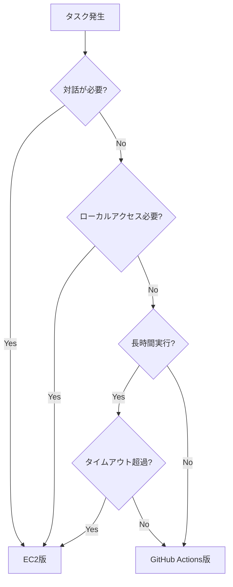

# GitHub Actions調査報告書 レビュー結果

## レビュー概要

| 項目 | 内容 |
|-----|-----|
| レビュー対象 | `/home/ubuntu/work/Director/docs/research/GitHubActions/` 配下の調査報告書 |
| レビュー実施日 | 2025-12-15 |
| レビュー観点 | 可読性、整合性、妥当性、暫定検討箇所の注意書き |

## レビュー結果サマリー

| ファイル | 指摘数 | 重要度高 | 重要度中 | 重要度低 |
|---------|-------|---------|---------|---------|
| 01_はじめに.md | 3 | 0 | 2 | 1 |
| 02_GitHubActionsの動作の実態.md | 4 | 1 | 2 | 1 |
| 03_同時並行でのワークフロー実行.md | 2 | 0 | 1 | 1 |
| 04_EC2上ClaudeAgentSDKとの違い.md | 5 | 0 | 3 | 2 |
| 05_参照するコンテキスト範囲.md | 4 | 1 | 2 | 1 |
| 06_GitHubActionsの使用方法.md | 3 | 0 | 2 | 1 |
| **合計** | **21** | **2** | **12** | **7** |

---

## 1. 01_はじめに.md

### 指摘1-1【整合性・重要度中】目次リンクの不整合

**該当箇所**: 5行目〜15行目（目次）

**指摘内容**:
目次の章番号と実際の見出しの対応が不整合。「はじめに」が目次では番号なしだが、「1. 概要調査」から番号が始まっている。また、2〜6章は別ファイルへのリンクであるべきだが、アンカーリンク（#）になっている。

**修正案**:
```markdown
## 目次<!-- omit in toc -->

- [はじめに](#はじめに)
- [1. 概要調査：GitHub Actions Claude Code 調査結果](#1-概要調査github-actions-claude-code-調査結果)
  - [1.1. 目的](#11-目的)
  - [1.2. 参照](#12-参照)
  - [1.3. 概要](#13-概要)
  - [1.4. 特徴](#14-特徴)
- [2. GitHubActionsの動作の実態](./02_GitHubActionsの動作の実態.md)
- [3. 同時並行でのワークフロー実行](./03_同時並行でのワークフロー実行.md)
- [4. EC2上で使用するClaudeAgentSDKとの違い](./04_EC2上ClaudeAgentSDKとの違い.md)
- [5. 参照するコンテキスト範囲](./05_参照するコンテキスト範囲.md)
- [6. GitHubActionsの使用方法](./06_GitHubActionsの使用方法.md)
```

---

### 指摘1-2【整合性・重要度中】参照リンクの検証が必要

**該当箇所**: 40行目〜43行目

**指摘内容**:
参照先URLの有効性が未確認。特に以下のリンクはリダイレクトが発生する可能性がある：
- `https://docs.anthropic.com/ja/docs/claude-code` → `https://docs.claude.com/` にリダイレクト

**修正案**:
```markdown
### 1.2. 参照

- [Claude Code Action - GitHub](https://github.com/anthropics/claude-code-action)
- [GitHub Actions ドキュメント](https://docs.github.com/ja/actions)
- [Claude Code ドキュメント](https://docs.claude.com/ja/docs/claude-code)
- [AWS Bedrock ドキュメント](https://docs.aws.amazon.com/bedrock/)
```

---

### 指摘1-3【可読性・重要度低】冗長な表現

**該当箇所**: 98行目

**指摘内容**:
フッターのリンク「[目次](./01_はじめに.md#はじめに)」が自己参照となっており、同一ファイル内であれば `[目次](#目次)` で十分。

**修正案**:
```markdown
[目次](#目次)
```

---

## 2. 02_GitHubActionsの動作の実態.md

### 指摘2-1【妥当性・重要度高】モデル名が古い可能性

**該当箇所**: 全般（モデル名の記載箇所）

**指摘内容**:
本プロジェクトではGitHub ActionsとEC2の両方でClaude Codeを使用する計画だが、使用するモデル名やバージョンが最新かどうかの確認が必要。AWS Bedrockで使用可能なモデルIDは頻繁に更新される。

**修正案**:
以下の注意書きを追加することを推奨：
```markdown
> **注意**: 記載のモデルID（例：`anthropic.claude-sonnet-4-20250514-v1:0`）は2025年12月時点のものである。
> AWS Bedrockで使用可能なモデルは随時更新されるため、最新のモデルIDはAWS公式ドキュメントを参照すること。
```

---

### 指摘2-2【整合性・重要度中】ランナー環境の仕様値の根拠

**該当箇所**: 140行目〜147行目

**指摘内容**:
ランナー環境の仕様（CPU 4コア、メモリ16GB等）は2025年時点の値だが、GitHubは随時これを更新する可能性がある。参照元または確認日を明記すべき。

**修正案**:
```markdown
### 2.4.1. ランナー環境

| 項目 | 仕様 |
|-----|-----|
| OS | Ubuntu Latest（ubuntu-24.04） |
| CPU | 4コア |
| メモリ | 16GB |
| ストレージ | 14GB（SSD） |
| Node.js | 20.x |
| 実行時間上限 | 6時間（ジョブ単位） |

> **参考**: 上記はGitHub-hosted runnerの標準仕様（2025年12月時点）。
> 最新の仕様は[GitHub公式ドキュメント](https://docs.github.com/ja/actions/using-github-hosted-runners/about-github-hosted-runners)を参照。
```

---

### 指摘2-3【可読性・重要度中】mermaid図の表示確認

**該当箇所**: 208行目〜224行目

**指摘内容**:
mermaid記法のシーケンス図が含まれているが、GitHubのMarkdownプレビューやその他のビューアで正しく表示されるか確認が必要。一部のMarkdownビューアではmermaidがサポートされていない。

**修正案**:
代替として静的な図（PNG/SVG）を`images/`フォルダに配置し、両方を記載することを推奨：
```markdown
## 2.6. 動作フロー

<!-- GitHubのMarkdownプレビューで表示される場合 -->
```mermaid
sequenceDiagram
    ...
```

<!-- mermaidが表示されない環境向け -->
> mermaid図が表示されない場合は、[動作フロー図](./images/動作フロー.png)を参照。
```

---

### 指摘2-4【可読性・重要度低】文体の統一

**該当箇所**: 全般

**指摘内容**:
文末が「〜である」「〜する」の「だ・である調」で統一されているが、一部箇所で箇条書きの文末に句点がない。統一が望ましい。

**例**: 119行目〜123行目
```markdown
1. コメント内容からプロンプトを抽出
2. リポジトリをチェックアウト
3. Claude Codeが指示を実行
```

---

## 3. 03_同時並行でのワークフロー実行.md

### 指摘3-1【暫定検討箇所・重要度中】concurrency設定の暫定性

**該当箇所**: 102行目〜108行目、154行目〜194行目

**指摘内容**:
concurrency設定は実運用時にプロジェクトの要件に応じて調整が必要となる暫定的な設定である。変更発生の可能性について注意書きがない。

**修正案**:
```markdown
### 3.4.1. 同じファイルへの変更（コンフリクト）

（中略）

**ワークフローでの設定**:

> **注意**: 以下のconcurrency設定は一般的な推奨例である。
> 実際のプロジェクト要件（同時実行の必要性、コンフリクト発生頻度等）に応じて調整すること。

```yaml
# 同じIssueに対する実行を直列化
concurrency:
  group: claude-${{ github.event.issue.number || github.event.pull_request.number }}
  cancel-in-progress: false
```
```

---

### 指摘3-2【可読性・重要度低】表現の統一

**該当箇所**: 55行目〜57行目

**指摘内容**:
「技術的には問題なし」という見出しは断定的すぎる印象がある。より正確な表現に修正することを推奨。

**修正案**:
```markdown
### 3.3.1. 基本的な並列実行の挙動

複数のIssue/PRでClaude Codeを同時実行することは、技術的に対応している。
```

---

## 4. 04_EC2上ClaudeAgentSDKとの違い.md

### 指摘4-1【整合性・重要度中】04_と05_の内容重複

**該当箇所**: 104行目〜117行目（5.3. EC2版との比較）

**指摘内容**:
「04_EC2上ClaudeAgentSDKとの違い.md」と「05_参照するコンテキスト範囲.md」の両方に「EC2版との比較」セクションがあり、内容が重複している。05_のコンテキスト比較は04_から参照する形式にするか、内容を統合すべき。

**修正案（05_参照するコンテキスト範囲.md）**:
```markdown
## 5.3. EC2版との比較

コンテキストアクセス範囲の詳細な比較については、[04_EC2上ClaudeAgentSDKとの違い.md](./04_EC2上ClaudeAgentSDKとの違い.md)を参照。
本章ではコンテキスト管理に焦点を当てた比較のみ記載する。
```

---

### 指摘4-2【整合性・重要度中】マルチエージェント構成図との整合性

**該当箇所**: 全般

**指摘内容**:
参考資料のマルチエージェントシステム構成図（マルチエージェントシステム構成図2.png）では、EC2とGitHub Actionsの役割分担が示されている（EC2: Cody Agent、Coding Agentなど、GitHub Actions: CI/CD Pipeline）。本報告書の使い分け指針がこの構成図と整合しているか確認が必要。

**修正案**:
「4.5. 使い分け指針」に構成図への参照を追加：
```markdown
## 4.5. 使い分け指針

> **参考**: 本プロジェクトのマルチエージェントシステム構成については、
> 別途「マルチエージェントシステム構成図」を参照のこと。
> 以下は一般的なシナリオ別の推奨である。
```

---

### 指摘4-3【暫定検討箇所・重要度中】ハイブリッド運用の暫定性

**該当箇所**: 172行目〜222行目

**指摘内容**:
「4.6. ハイブリッド運用の提案」はプロジェクト要件に応じて変更される可能性が高い暫定的な提案だが、その旨の注意書きがない。

**修正案**:
```markdown
## 4.6. ハイブリッド運用の提案

> **注意**: 本章の運用提案は一般的なガイドラインである。
> 実際の運用パターンはプロジェクトの要件、チーム構成、既存のCI/CDパイプラインに応じて検討・調整すること。

両方を組み合わせることで、それぞれの長所を活かした運用が可能。
```

---

### 指摘4-4【可読性・重要度低】mermaid図のノード名

**該当箇所**: 201行目〜211行目

**指摘内容**:
mermaidのフローチャートで日本語と改行（`<br>`）が混在しており、一部のビューアで表示が崩れる可能性がある。

**修正案**:
```markdown

```

---

### 指摘4-5【可読性・重要度低】絵文字の使用

**該当箇所**: 124行目〜133行目

**指摘内容**:
表内で絵文字（✅❌△）を使用しているが、一部の環境や印刷時に正しく表示されない可能性がある。凡例を追加するか、テキストに置き換えることを検討。

**修正案**:
表の前に凡例を追加：
```markdown
**凡例**: ✅=対応 / ❌=非対応 / △=条件付き対応
```

---

## 5. 05_参照するコンテキスト範囲.md

### 指摘5-1【妥当性・重要度高】コンテキストウィンドウの値が古い可能性

**該当箇所**: 161行目〜165行目

**指摘内容**:
コンテキストウィンドウのサイズ（200K tokens）と出力上限（4K/8K tokens）はモデルバージョンによって異なる。Claude 3.5 Sonnetの出力上限は現在8192 tokensだが、将来変更される可能性がある。

**修正案**:
```markdown
### 5.4.1. モデル別のコンテキストウィンドウ

> **注意**: 以下の値は2025年12月時点のものである。
> モデルの仕様は随時更新されるため、最新情報はAnthropic公式ドキュメントを参照すること。

| モデル | コンテキストウィンドウ | 出力上限 |
|--------|----------------------|---------|
| Claude 3 Opus | 200K tokens | 4K tokens |
| Claude 3.5 Sonnet | 200K tokens | 8K tokens |
| Claude 3 Haiku | 200K tokens | 4K tokens |
```

---

### 指摘5-2【整合性・重要度中】コードブロックの言語指定

**該当箇所**: 59行目〜66行目、69行目〜77行目、80行目〜85行目

**指摘内容**:
イベントコンテキストの説明でYAML形式のコードブロックを使用しているが、内容はYAMLではなくリスト形式。言語指定を削除するか、適切な形式に変更すべき。

**修正案**:
```markdown
**issue_comment イベント**:
- Issue番号、タイトル、本文
- Issue作成者
- Issueのラベル
- トリガーとなったコメント内容
- コメント作成者
- 過去のIssueコメント履歴（API経由）
```

---

### 指摘5-3【可読性・重要度中】ASCII図の表示

**該当箇所**: 122行目〜155行目

**指摘内容**:
ASCII図（罫線文字を使用した図）が含まれているが、フォントによっては表示が崩れる可能性がある。等幅フォントでの表示を前提としている旨を注記するか、代替表現を検討すべき。

**修正案**:
```markdown
**GitHub Actions版**:

> ※以下の図は等幅フォントでの表示を想定

```
┌─────────────────────────────────────┐
│         実行1（Issue #1）           │
...
```
```

---

### 指摘5-4【可読性・重要度低】見出しレベルの飛び

**該当箇所**: 240行目〜254行目

**指摘内容**:
「5.6.1. コンテキスト冗長化の問題」のサブセクション内に「問題のパターン」「対策」があるが、これらは太字（`**`）で記載されている。他のセクションとの整合性を考慮し、形式を統一すべき。

---

## 6. 06_GitHubActionsの使用方法.md

### 指摘6-1【暫定検討箇所・重要度中】設定値の暫定性

**該当箇所**: 63行目〜81行目（IAMポリシー）、90行目〜112行目（信頼関係ポリシー）

**指摘内容**:
IAMポリシーやロールの設定例は、プロジェクトのセキュリティ要件によって変更が必要となる暫定的な設定である。特にリソース指定（`Resource: "*"`や`anthropic.claude-*`）は本番環境では最小権限に絞るべき。

**修正案**:
```markdown
### 6.3.2. IAMポリシーの作成

> **注意**: 以下のポリシー例はすべてのClaudeモデルへのアクセスを許可している。
> 本番環境では、使用するモデルとリージョンを明示的に指定し、最小権限の原則に従うこと。

**ポリシーJSON（開発環境向け例）**:
```json
...
```
```

---

### 指摘6-2【整合性・重要度中】プレースホルダーの統一

**該当箇所**: 98行目、106行目、114行目、135行目

**指摘内容**:
プレースホルダーの表記が `[ACCOUNT-ID]`、`[OWNER]`、`[REPO]` と角括弧を使用しているが、YAML内のシークレット参照（`${{ secrets.XXX }}`）と混在して読みにくい。

**修正案**:
プレースホルダーであることを明確にするため、以下のいずれかに統一：
- `<ACCOUNT-ID>` 形式（山括弧）
- `YOUR_ACCOUNT_ID` 形式（大文字スネークケース）

---

### 指摘6-3【可読性・重要度低】トラブルシューティングの構成

**該当箇所**: 390行目〜442行目

**指摘内容**:
トラブルシューティングセクションは有用だが、エラーメッセージと対処法の対応が明確になるよう表形式にすることを検討。

**修正案**:
```markdown
## 6.9. トラブルシューティング

| エラー | 原因 | 対処法 |
|-------|------|-------|
| `Invalid API key` | APIキーが無効 | `ANTHROPIC_API_KEY`の値を確認 |
| `Access Denied` | IAM権限不足 | IAMロールの信頼関係とポリシーを確認 |
| `Job timeout` | 実行時間超過 | `timeout-minutes`を増やす（最大360分） |
| `Resource not accessible` | GitHub権限不足 | `permissions`ブロックの設定を確認 |
| `Merge conflict` | ブランチ競合 | ベースブランチを最新化して再実行 |
```

---

## 全体に対する指摘

### 全体指摘1【整合性】ファイル命名規則

**指摘内容**:
ファイル名の命名規則が一部不統一。「04_EC2上ClaudeAgentSDKとの違い.md」のみ「上」が入っているが、他は「の」で接続している。

**現状**:
- 02_GitHubActions**の**動作の実態.md
- 04_EC2**上**ClaudeAgentSDKとの違い.md

**修正案**:
`04_EC2上ClaudeAgentSDKとの違い.md` → `04_EC2でのClaudeAgentSDKとの違い.md`

---

### 全体指摘2【妥当性】フォルダ構成

**指摘内容**:
現状のフォルダ構成は妥当だが、mermaid図やASCII図の画像版を配置する場合は`images/`フォルダを作成することを推奨。

**推奨構成**:
```
/home/ubuntu/work/Director/docs/research/GitHubActions/
├── 01_はじめに.md
├── 02_GitHubActionsの動作の実態.md
├── 03_同時並行でのワークフロー実行.md
├── 04_EC2上ClaudeAgentSDKとの違い.md
├── 05_参照するコンテキスト範囲.md
├── 06_GitHubActionsの使用方法.md
├── images/                          # 追加推奨
│   ├── 動作フロー.png
│   └── タスク振り分けフロー.png
└── レビュー結果_GitHubActions調査報告書.md
```

---

### 全体指摘3【可読性】文体の統一確認

**指摘内容**:
全体として「だ・である調」で統一されており、問題なし。ただし、箇条書き末尾の句点有無が混在している箇所がある。

---

## 修正優先度

### 優先度高（早急に対応）
1. 【指摘2-1】モデル名の最新性確認と注意書き追加
2. 【指摘5-1】コンテキストウィンドウの値の注意書き追加

### 優先度中（次回更新時に対応）
1. 【指摘1-1】目次リンクの修正
2. 【指摘1-2】参照リンクの検証・修正
3. 【指摘2-2】ランナー環境仕様の参照元追記
4. 【指摘2-3】mermaid図の代替表示対応
5. 【指摘3-1】concurrency設定の暫定性注記
6. 【指摘4-1】内容重複の整理
7. 【指摘4-2】構成図との整合性確認
8. 【指摘4-3】ハイブリッド運用の暫定性注記
9. 【指摘5-2】コードブロック言語指定の修正
10. 【指摘5-3】ASCII図の注記追加
11. 【指摘6-1】IAM設定の暫定性注記
12. 【指摘6-2】プレースホルダー表記の統一

### 優先度低（時間があれば対応）
1. 【指摘1-3】フッターリンクの簡略化
2. 【指摘2-4】箇条書き句点の統一
3. 【指摘3-2】見出し表現の修正
4. 【指摘4-4】mermaidノード名の簡略化
5. 【指摘4-5】絵文字凡例の追加
6. 【指摘5-4】見出しレベル・形式の統一
7. 【指摘6-3】トラブルシューティングの表形式化
8. 【全体指摘1】ファイル命名規則の統一
9. 【全体指摘2】imagesフォルダの作成
10. 【全体指摘3】箇条書き句点の統一

---

## 総評

本調査報告書は、GitHub ActionsでのClaude Code使用方法とEC2版との違いについて、必要な情報が網羅的にまとめられている。構成も論理的で、参考資料のマルチエージェントシステム構成図が示す「EC2とGitHub Actionsの役割分担」という方針に沿った内容となっている。

主な改善点として、以下を推奨する：
1. **暫定検討箇所の明記**: 設定例や運用提案は実運用時に調整が必要となるため、その旨の注意書きを追加
2. **最新性の担保**: モデル名やランナー仕様など、変更される可能性のある値には確認日と参照先を明記
3. **重複内容の整理**: 04_と05_で重複しているEC2比較内容の整理

全体として、開発チームがGitHub Actions版Claude Codeを導入する際の有用なガイドとなる品質を備えている。
