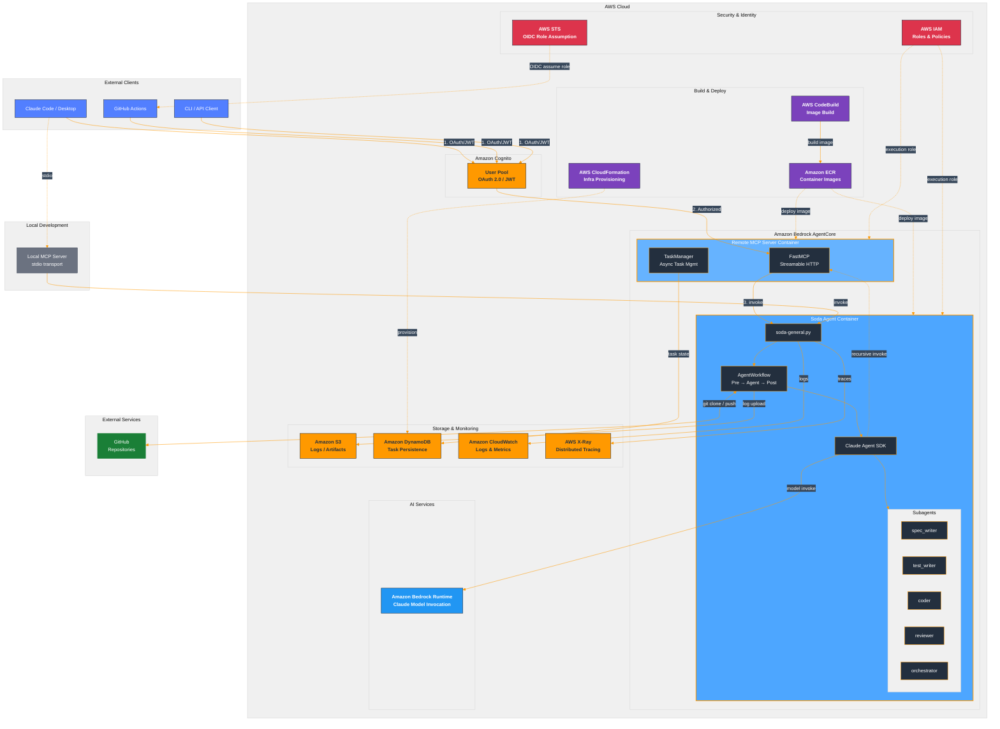

# Soda初心者向けガイド

- [Soda初心者向けガイド](#soda初心者向けガイド)
  - [はじめに](#はじめに)
  - [(1) Sodaとは](#1-sodaとは)
    - [Sodaとは](#sodaとは)
    - [Sodaの主な機能](#sodaの主な機能)
    - [Sodaの公式リポジトリ](#sodaの公式リポジトリ)
  - [(2) 前提知識](#2-前提知識)
    - [AWS](#aws)
    - [Claude Code](#claude-code)
    - [Amazon Bedrock AgentCore](#amazon-bedrock-agentcore)
  - [(3) Sodaのドキュメントの「チュートリアル」と「ガイド」](#3-sodaのドキュメントのチュートリアルとガイド)
    - [比較表](#比較表)
    - [チュートリアル（2本）](#チュートリアル2本)
    - [ガイド（5本）](#ガイド5本)
    - [使い分けの例](#使い分けの例)
  - [(4) Sodaのシステム全体構成](#4-sodaのシステム全体構成)
  - [(5) Soda環境構築の手順](#5-soda環境構築の手順)
  - [(6) 変更履歴](#6-変更履歴)

## はじめに
本ドキュメントは、Soda (Software Developer Agents) 初心者向けにXXXXを説明します。

## (1) Sodaとは
### Sodaとは
Soda (Software Developer Agents) は、AWS Bedrock AgentCore上で動作するAIソフトウェアエンジニアリングエージェントです。
Git統合、MCP（Model Context Protocol）サーバー、特化型サブエージェントによるマルチエージェントワークフローをサポートしています。

### Sodaの主な機能
- Git統合
  - リポジトリのクローン、ブランチ管理、自動コミット・プッシュ
- MCPサーバー
  - ローカル/リモートの2つのMCPサーバーを提供
- サブエージェントシステム
  - TDD開発ワークフローを支援する特化型エージェント
- Claude Code連携
  - スキルとサブエージェントによるオーケストレーション

### Sodaの公式リポジトリ
- 公式リポジトリ
  - https://github.com/IoVPF-AgenticSoftwareEngineering/soda

## (2) 前提知識
### AWS
  - AWSアカウントの基本操作（マネジメントコンソールへのログイン、リージョン選択）
  - AWS CLIのインストールと初期設定（`aws configure`）
  - IAMの基本概念（ユーザー、ロール、ポリシー、OIDC）
  - Amazon S3の基本操作（バケット、オブジェクトの概念）
  - Amazon CloudWatch Logsの閲覧方法
  - AWS CloudFormationの基本概念（スタック、テンプレート）
  - Amazon ECRの基本概念（コンテナイメージのリポジトリ）
### Claude Code
  - Claude Code自体、及び、Claude Codeの「Skills」、「Subagent」、「Plugins」、「Rules」
  - https://zenn.dev/heku/books/claude-code-guide
  - https://zenn.dev/tmasuyama1114/books/claude_code_basic
### Amazon Bedrock AgentCore
  - https://dev.classmethod.jp/articles/amazon-bedrock-agentcore-2025-summary/
  - https://dev.classmethod.jp/articles/amazon-bedrock-agentcore-developersio-2025-osaka/

## (3) Sodaのドキュメントの「チュートリアル」と「ガイド」
Sodaの公式リポジトリのドキュメントは、「チュートリアル」と「ガイド」を使い分けています。

### 比較表
| 観点 | チュートリアル | ガイド |
|------|-------------|--------|
| **目的** | 学習指向（Learning-oriented） | 作業指向（Task-oriented） |
| **構成** | ステップバイステップで一連の流れを体験 | 特定トピックごとに分割された手順書 |
| **読み方** | 最初から最後まで順番に進める | 必要な箇所だけ参照する |
| **対象者** | 初めてSodaを使う人 | 基本を理解した上で特定タスクを実行する人 |
| **所要時間** | 明示（開発者: 30〜45分、ユーザー: 15〜20分） | 明示なし（必要な部分だけ読む想定） |
| **前提知識** | 最小限（環境構築から始まる） | チュートリアルまたは一定の知識が前提 |

### チュートリアル（2本）

| ドキュメント | 内容 |
|-------------|------|
| [開発者チュートリアル](docs/guide/tutorial-developer.md) | Python/uv/AWS CLI のインストール → デプロイ → 動作確認 → 運用まで、**一気通貫で体験**する |
| [ユーザーチュートリアル](docs/guide/tutorial-user.md) | デプロイ済みのSodaに対して、AWS CLI設定 → 基本呼び出し → MCP連携まで、**使い始めの流れを体験**する |

→ 初心者が「Sodaとは何か」「何ができるか」を**手を動かしながら理解する**ためのドキュメント

### ガイド（5本）

| ドキュメント | 内容 |
|-------------|------|
| [セットアップガイド](docs/guide/setup.md) | 開発環境構築の詳細手順 |
| [デプロイガイド](docs/guide/deployment.md) | AgentCoreへのデプロイ方法 |
| [使用ガイド](docs/guide/usage.md) | ペイロードパラメータ・サブエージェント指定等の詳細 |
| [MCPガイド](docs/guide/mcp.md) | ローカル/リモートMCPサーバーの設定と使用 |
| [IAMパーミッションガイド](docs/guide/iam-permissions.md) | 必要なAWS権限の詳細 |

→ 特定の作業を行うときに**リファレンスとして参照する**ドキュメント

### 使い分けの例

```
初回利用:
  開発者 → 「開発者チュートリアル」を最初から最後まで実施
  ユーザー → 「ユーザーチュートリアル」を最初から最後まで実施

日常利用:
  「MCP設定を変更したい」→ MCPガイドを参照
  「新しいIAMユーザーを追加したい」→ IAMパーミッションガイドを参照
  「パラメータの詳細を知りたい」→ 使用ガイドを参照
```

## (4) Sodaのシステム全体構成



## (5) Soda環境構築の手順
※作成途中です

  - [開発者チュートリアル](docs/guide/tutorial-developer.md) の通り進める
    - 注意点1：Sodaのデプロイ先のAWSリージョンを任意先にする場合、xxxに修正が必要です。
    - 注意点2：SodaのリモートMCPを動作させるにはOAuth/Cognito認証が必要です。
    - 注意点3：Amazon Bedrock AgentCoreにデプロイするエージェントランタイム名（"soda","soda_remote_mcp"）を別名にする場合、xxxに修正が必要です。

## (6) 変更履歴

| 変更日       | 版数  | 変更内容                     | 変更者 |
| ------------ | ----- | ---------------------------- | ------ |
| 2026-02-12   | 0.1  | ・新規作成                     | 松下 |
| 2026-02-13   | 0.2  | ・目次を追加<br>・Sodaのシステム全体構成を追加 | 松下 |
